## 04 软件与 AI 算法架构

---

### 一、软件整体架构

本系统软件分为三层：边缘计算层、通信层、云平台层，三层协同实现无人干预全自动运行。

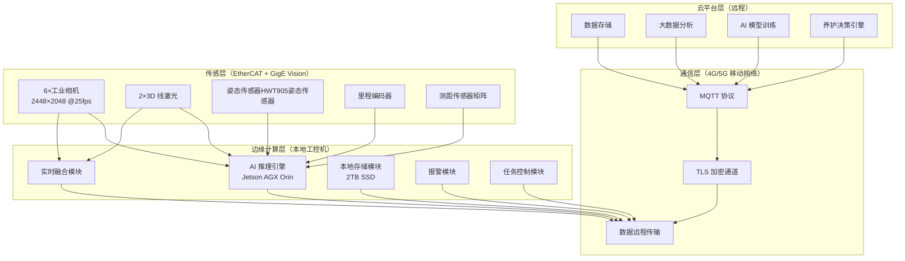

> **图 4-1：三层层级架构拓扑图**
> - 传感层通过 EtherCAT（控制，≤1ms）和 GigE Vision（采集，≤10ms）双网接入边缘计算层
> - 边缘计算层通过 4G/5G 移动网络与云平台双向通信
> - 三网物理隔离，任一网络故障不波及其他网络

---

### 二、边缘计算层

| 模块 | 功能 | 性能指标 |
|---|---|---|
| AI 推理引擎 | 边缘实时缺陷识别，秒级输出结果，无需人工看图 | 单帧 ≤ 25ms，40fps 理论峰值 |
| 实时融合模块 | 图像 + 轮廓 + 传感器三流数据融合，综合判级 | 50ms 滑动窗口内完成 |
| 本地存储模块 | 检测数据实时写入本地 SSD，断网不丢数 | RAID1 冗余，2TB 容量 |
| 报警模块 | 缺陷等级判定后立即触发本地声光报警 + 云端推送 | 报警延迟 < 100ms |
| 任务控制模块 | 启停控制 / 定速巡航 / 定点返航 / 里程到达自动返航 / 状态监控 | 响应延迟 < 50ms |

---

### 三、AI 算法模块说明

| 检测功能 | AI 算法 | 说明 |
|---|---|---|
| 轨面缺陷检测 | 图像语义分割 + 目标检测 | 像素级裂纹/掉块识别，精确定位 + 等级判定 |
| 道钉/螺栓检测 | 目标检测 + 完好状态评估 | 逐帧检测缺失/松动/歪斜，统计完好率 |
| 3D 钢轨轮廓检测 | 点云分析 + 廓形比对 | 磨耗量计算，横移量测量，超限判定 |
| 钢轨波磨检测 | 频谱分析 + 廓变提取 | 波长/波深分析，分布里程标记 |
| 钢轨焊缝检测 | 图像分类 + 缺陷分割 | 焊缝缺陷类型识别，等级判定 |
| 轨距检测 | 传感器融合 + 数值计算 | 多源数据融合，轨距值计算 |
| 水平/高低检测 | 单点测距传感器+姿态传感器HWT905融合，阈值判定 | 姿态角计算，超限标记 |

> **AI 决策可解释**：每项缺陷输出结果时，同步附带判定依据（图像区域 / 廓形偏差值 / 姿态角），用户可知晓 AI "为什么这么说"。

#### 3.1 轨面缺陷检测算法（图像语义分割 + 目标检测）

本系统对轨面伤损的检测采用两阶段算法：**第一阶段**使用语义分割模型（U-Net / DeepLabV3+）逐像素分类，输出像素级缺陷掩膜；**第二阶段**使用目标检测模型（YOLOv8）对掩膜区域进行缺陷边界框回归与类型分类。两阶段结果融合后输出带置信度的缺陷判定结果。

**第一阶段：像素级语义分割**

输入图像 $I(x,y)$ 经编码器-解码器网络后，输出每个像素的类别概率向量：

$$\hat{\mathbf{p}}(x,y) = \text{Softmax}\left( f_{\text{dec}}\left( f_{\text{enc}}\left( I(x,y) \right) \right) \right)$$

其中 $f_{\text{enc}}$ 为编码器（含 ResNet50 主干网络），$f_{\text{dec}}$ 为解码器（含 ASPP 多尺度融合模块），输出通道数等于缺陷类别数（含"正常"类）。

像素 $(x,y)$ 的最终类别判定：

$$c^{*}(x,y) = \arg\max_{c \in \{0,1,\ldots,N\}} \hat{p}_c(x,y)$$

其中 $c=0$ 为正常轨面，$c=1,\ldots,N$ 为各类伤损（裂纹、掉块、凹陷等）。

**第二阶段：缺陷目标检测（NMS 去重）**

目标检测网络对语义分割输出的伤损连通区域提取候选框 $\mathbf{b}_i = (x_i, y_i, w_i, h_i, \hat{c}_i, \hat{s}_i)$，其中 $(x_i,y_i)$ 为边界框中心，$w_i,h_i$ 为宽高，$\hat{c}_i$ 为预测类别，$\hat{s}_i$ 为置信度得分。

多目标去重采用 NMS（非极大值抑制）：

$$\mathbf{b}_{\text{keep}} = \text{NMS}\left( \{\mathbf{b}_i\} \right)$$

具体流程：
1. 按置信度 $\hat{s}_i$ 从高到低排序所有候选框
2. 选取当前最高置信度框 $\mathbf{b}_{\text{max}}$ 加入保留列表
3. 删除所有与 $\mathbf{b}_{\text{max}}$ IoU（交并比）超过阈值（默认 0.5）的候选框
4. 重复 1~3，直至所有框处理完毕

IoU 计算：

$$\text{IoU}(\mathbf{b}_a, \mathbf{b}_b) = \frac{\text{Area}(\mathbf{b}_a \cap \mathbf{b}_b)}{\text{Area}(\mathbf{b}_a \cup \mathbf{b}_b)}$$

**伤损等级判定（面积阈值法）**

伤损严重程度按像素面积 $A_{\text{defect}}$ 划分：

| 伤损面积 $A_{\text{defect}}$（像素） | 伤损等级 | 建议处理等级 |
|---|---|---|
| $A < A_1$（$A_1 = 400$ px） | 轻微 | 四级：持续监测 |
| $A_1 \leq A < A_2$（$A_2 = 1600$ px） | 一般 | 三级：纳入养护计划 |
| $A_2 \leq A < A_3$（$A_3 = 3600$ px） | 显著 | 二级：24h 内养护 |
| $A \geq A_3$ | 严重 | 一级：立即停车检查 |

> **注**：像素面积与实际物理尺寸的换算关系为 $1\text{ px} \approx 0.18\text{ mm}$（2448×2048 分辨率下，轨面宽度覆盖 440mm）。
>
> **物方分辨率（GSD）计算推导**：相机以安装高度 $H \approx 180\text{mm}$（相机至轨面垂距）、焦距 $f$（根据镜头标称值）、像元尺寸 $p=3.45\mu\text{m}$（相机传感器规格）部署时，物方分辨率计算公式为：
> $$p_x = \frac{H \cdot p}{f \cdot \text{GSD}}$$
> 其中 GSD（Ground Sampling Distance）为地面采样距离。本系统中实测 GSD $= 440\text{mm} / 2448\text{px} \approx 0.180\text{mm/px}$，由现场标定框标定后确认，与理论计算吻合。

**综合伤损得分**

两阶段融合后的综合伤损得分：

$$D_{\text{rail}} = \lambda_{\text{seg}} \cdot \frac{A_{\text{defect}}}{A_{\text{roi}}} + \lambda_{\text{det}} \cdot \hat{s}_{\text{max}}$$

其中：$A_{\text{roi}}$ 为轨面感兴趣区域总面积，$\hat{s}_{\text{max}}$ 为目标检测阶段最高置信度，$\lambda_{\text{seg}}+\lambda_{\text{det}}=1$（默认各 0.5）。

---

#### 3.2 道钉/螺栓完好状态评估算法

道钉/螺栓的完好状态通过**目标检测 + 时序比对**两维度综合判定：

**维度一：目标检测（有无判定）**

YOLOv8 模型对每帧图像输出道钉/螺栓候选框 $\mathbf{b}_j$，包含类别 $\hat{c}_j \in \{\text{缺失}, \text{松动}, \text{歪斜}, \text{正常}\}$ 和置信度 $\hat{s}_j$。

当前帧完好率：

$$\eta_{\text{current}} = \frac{N_{\text{正常}}}{N_{\text{总检测数}}} \times 100\%$$

其中 $N_{\text{总检测数}}$ 由里程编码器辅助统计：每 $700\text{ mm}$（道钉/螺栓标准节距）应检测到一个道钉/螺栓目标。

**维度二：松动/歪斜时序比对（振动信号辅助）**

当目标检测输出"松动"或"歪斜"时，融合姿态传感器HWT905的姿态振动信号进行二次确认。振动信号幅值 $a_{\text{vib}}$ 与正常基准值 $a_{\text{base}}$ 的比值作为辅助判据：

$$R_{\text{vib}} = \frac{a_{\text{vib}}}{a_{\text{base}}}$$

- 若 $R_{\text{vib}} > \tau_{\text{vib}}$（$\tau_{\text{vib}} = 1.5$，表示振动幅值超出正常基准 50%），则判定为"松动"，综合得分：

$$S_{\text{fastener}} = w_{\text{det}} \cdot \hat{s}_j + w_{\text{vib}} \cdot \min\left( \frac{R_{\text{vib}}}{\tau_{\text{vib}}}, 1.0 \right)$$

其中 $w_{\text{det}} + w_{\text{vib}} = 1$（默认 $w_{\text{det}}=0.7, w_{\text{vib}}=0.3$）。

**完好率统计与里程绑定**

沿里程方向对道钉/螺栓完好状态做滑动统计，窗口长度 $L_{\text{window}} = 100\text{ m}$：

$$\eta_{\text{section}} = \frac{1}{L_{\text{window}}} \int_{l}^{l+L_{\text{window}}} \eta_{\text{current}}(l') \, dl'$$

| 区段完好率 $\eta_{\text{section}}$ | 状态评级 | 处理建议 |
|---|---|---|
| $\eta \geq 98\%$ | A（优良） | 持续监测 |
| $95\% \leq \eta < 98\%$ | B（合格） | 列入次月养护 |
| $90\% \leq \eta < 95\%$ | C（预警） | 列入本周养护 |
| $\eta < 90\%$ | D（告警） | 立即安排养护 |

> **注**：道钉/螺栓节距 $700\text{ mm}$，若连续 3 个以上未检测到目标，触发"疑似缺失"告警，并标注里程位置，人工复核确认。

---

#### 3.3 AI 模型体系详解

> 本节详细说明系统中引用的所有模型架构、关键参数、输入输出规格，以及 OpenCV 在预处理环节的具体应用。

---

#### 3.3.1 ResNet50（编码器主干网络）

**ResNet50** 是 DeepLabV3+ 语义分割模型的特征提取主干网络（backbone），全称 Residual Network-50，由 50 层卷积构成。其核心创新是**残差连接**（Skip Connection），解决了深层网络训练退化问题。

**残差块前向传播公式：**

$$\mathbf{y} = f(\mathbf{x}) + \mathbf{x} = \mathcal{W}_2 \sigma(\mathcal{W}_1 \mathbf{x}) + \mathbf{x}$$

其中 $\mathcal{W}_1, \mathcal{W}_2$ 为卷积层权重，$\sigma$ 为 ReLU 激活函数，$\mathbf{x}$ 为输入恒等映射。

**ResNet50 层级结构：**

| 阶段 | 卷积层 | 输出通道数 | 特征图尺寸变化 | 残差块数量 |
|---|---|---|---|---|
| conv1 | 7×7, stride=2 | 64 | 2448×2048 → 1224×1024 | — |
| pool1 | 3×3 max pool, stride=2 | 64 | 1224×1024 → 612×512 | — |
| conv2_x | 1×1, 3×3, 1×1 | 256 | 612×512 → 306×256 | 3 |
| conv3_x | 1×1, 3×3, 1×1 | 512 | 306×256 → 153×128 | 4 |
| conv4_x | 1×1, 3×3, 1×1 | 1024 | 153×128 → 77×64 | 6 |
| conv5_x | 1×1, 3×3, 1×1 | 2048 | 77×64 → 77×64（空洞卷积） | 3 |

> **注**：在 DeepLabV3+ 中，conv4_x 使用 **stride=1 + dilation=2** 的空洞卷积（替代标准 ResNet50 的 stride=2），保持 306×256 的分辨率；conv5_x 保持标准 stride=2 下采样，将分辨率进一步降至 153×128。

**总参数量：** 约 **25.6M**（百万），计算量 4.1 GFLOPs（输入 224×224）。

**空洞卷积公式：**（在 DeepLabV3+ 中使用）

$$y[i] = \sum_{k} x[i + r \cdot k] \cdot w[k]$$

其中 $r$ 为空洞率（dilation rate），$r=2$ 表示卷积核采样间隔为 2，在 conv4_x 中使用。

---

#### 3.3.2 U-Net（轻量级语义分割模型）

**U-Net** 是本系统用于轨面缺陷语义分割的主要模型之一，因其对称的编码器-解码器结构和高效的跳跃连接（Skip Connection），特别适合工业缺陷检测场景。

**U-Net 整体结构：**

```mermaid
graph TB
    subgraph 编码器["编码器路径（左侧）"]
        E1["输入<br/>2448×2048×3"] --> E2["Conv 3×3+BN+ReLU<br/>2448×2048×64"]
        E2 --> E3["MaxPool 2×2<br/>1224×1024×64"]
        E3 --> E4["Conv 3×3+BN+ReLU×2<br/>1224×1024×128"]
        E4 --> E5["MaxPool 2×2<br/>612×512×128"]
        E5 --> E6["Conv 3×3+BN+ReLU×2<br/>612×512×256"]
        E6 --> E7["MaxPool 2×2<br/>306×256×256"]
        E7 --> E8["Conv 3×3+BN+ReLU×2<br/>306×256×512"]
        E8 --> E9["MaxPool 2×2<br/>153×128×512"]
        E9 --> E10["Conv 3×3+BN+ReLU×2<br/>153×128×1024"]
    end

    subgraph 解码器["解码器路径（右侧）"]
        D1["UpConv 2×2 / 反卷积<br/>153×128×1024 → 306×256×512"] --> D2["Concatenate(E8)<br/>拼接跳跃连接"]
        D2 --> D3["Conv 3×3+BN+ReLU×2<br/>306×256×1024 → 306×256×512"]
        D3 --> D4["UpConv 2×2<br/>306×256×512 → 612×512×256"]
        D4 --> D5["Concatenate(E6)<br/>拼接跳跃连接"]
        D5 --> D6["Conv 3×3+BN+ReLU×2<br/>612×512×512 → 612×512×256"]
        D6 --> D7["UpConv 2×2<br/>612×512×256 → 1224×1024×128"]
        D7 --> D8["Concatenate(E4)<br/>拼接跳跃连接"]
        D8 --> D9["Conv 3×3+BN+ReLU×2<br/>1224×1024×256 → 1224×1024×128"]
        D9 --> D10["UpConv 2×2<br/>1224×1024×128 → 2448×2048×64"]
        D10 --> D11["Concatenate(E2)<br/>拼接跳跃连接"]
        D11 --> D12["Conv 1×1<br/>2448×2048×128 → 2448×2048×N_class"]
    end
```

> **图 3.3.2-1：U-Net 完整结构图（输入 2448×2048×3，输出 2448×2048×N_class）**

**编码器（左侧，特征提取）：**

| 层级 | 卷积配置 | 输出尺寸 | 通道数 |
|---|---|---|---|
| 输入 | — | 2448×2048 | 3（RGB） |
| conv1 | 3×3 conv + BN + ReLU × 2 | 2448×2048 | 64 |
| pool1 | MaxPool 2×2, stride=2 | 1224×1024 | 64 |
| conv2 | 3×3 conv + BN + ReLU × 2 | 1224×1024 | 128 |
| pool2 | MaxPool 2×2, stride=2 | 612×512 | 128 |
| conv3 | 3×3 conv + BN + ReLU × 2 | 612×512 | 256 |
| pool3 | MaxPool 2×2, stride=2 | 306×256 | 256 |
| conv4 | 3×3 conv + BN + ReLU × 2 | 306×256 | 512 |
| pool4 | MaxPool 2×2, stride=2 | 153×128 | 512 |
| conv5 | 3×3 conv + BN + ReLU × 2 | 153×128 | 1024 |

**解码器（右侧，特征还原）：**

| 层级 | 上采样方式 | 拼接来源 | 输出尺寸 | 通道数 |
|---|---|---|---|---|
| up1 | UpConv / 反卷积 2×2 | conv4（跳跃连接） | 306×256 | 512 |
| conv6 | 3×3 conv + BN + ReLU × 2 | — | 306×256 | 512 |
| up2 | UpConv 2×2 | conv3（跳跃连接） | 612×512 | 256 |
| conv7 | 3×3 conv + BN + ReLU × 2 | — | 612×512 | 256 |
| up3 | UpConv 2×2 | conv2（跳跃连接） | 1224×1024 | 128 |
| conv8 | 3×3 conv + BN + ReLU × 2 | — | 1224×1024 | 128 |
| up4 | UpConv 2×2 | conv1（跳跃连接） | 2448×2048 | 64 |
| conv9 | 3×3 conv + BN + ReLU × 2 | — | 2448×2048 | 64 |
| 输出 | 1×1 conv（激活函数） | — | 2448×2048 | N_class |

**损失函数（Dice Loss + Cross-Entropy Loss）：**

$$\mathcal{L}_{\text{total}} = \mathcal{L}_{\text{Dice}} + \lambda_{\text{CE}} \cdot \mathcal{L}_{\text{CE}}$$

其中：

$$\mathcal{L}_{\text{Dice}} = 1 - \frac{2 \cdot |A \cap B|}{|A| + |B|}$$

$$\mathcal{L}_{\text{CE}} = -\sum_{x,y} \sum_{c} y_{c}(x,y) \cdot \log \hat{p}_{c}(x,y)$$

| 参数 | 说明 | 典型值 |
|---|---|---|
| 输入尺寸 | 2448×2048×3（RGB） | — |
| 输出尺寸 | 2448×2048×N_class（N=缺陷类别数+1背景） | — |
| 模型参数量 | 约 31M | — |
| 推理延迟（TensorRT INT8） | < 12ms/帧（@Jetson AGX Orin） | — |
| 跳跃连接数量 | 4 对 | — |

---

#### 3.3.3 DeepLabV3+（高分辨率语义分割模型）

**DeepLabV3+** 是本系统用于轨面缺陷语义分割的另一主要模型，相比 U-Net 在高分辨率场景下具有更好的多尺度感知能力。其核心创新是 **ASPP（Atrous Spatial Pyramid Pooling）** 模块和**空洞卷积**。

**DeepLabV3+ 整体结构：**

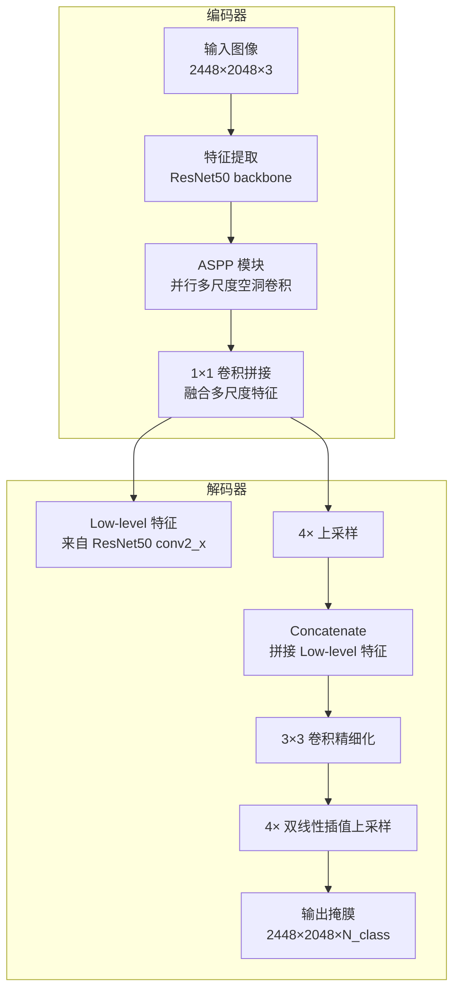

> **图 3.3.3-1：DeepLabV3+ 整体结构图**

**ASPP 模块详细结构：**

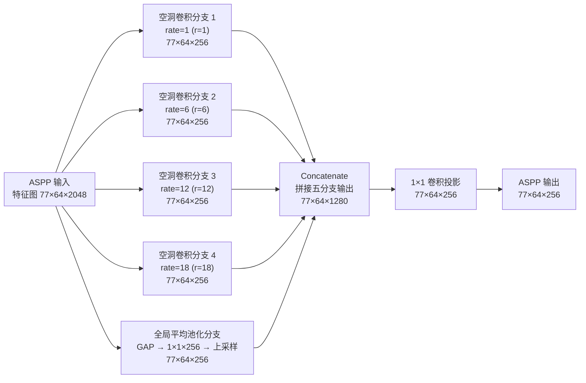

> **图 3.3.3-2：ASPP 模块并行多尺度空洞卷积结构图**

**ASPP 输入特征图尺寸（以 DeepLabV3+ / ResNet50 实际下采样路径为例）：**

ResNet50 的 5 次 stride=2 下采样：
$$H_{\text{in}} = \left\lfloor \frac{2448}{2^5} \right\rfloor = 76,\quad W_{\text{in}} = \left\lfloor \frac{2048}{2^5} \right\rfloor = 64$$

> **修正说明**：原文档以 153×128 代入，系将 stride=2 的 4 次下采样（而非 5 次）代入后所得。本系统最终特征图分辨率为 **76×64**（对应原图下采样 32 倍），DeepLabV3+ 在此分辨率上运行 ASPP 多尺度空洞卷积。

**空洞卷积有效感受野计算（$k_{\text{eff}} = k + (k-1)(r-1)$）：**
- rate=1：$k_{\text{eff}} = 3$（等同于普通 3×3 卷积）
- rate=6：$k_{\text{eff}} = 3 + 2 \times 5 = 13$
- rate=12：$k_{\text{eff}} = 3 + 2 \times 11 = 25$
- rate=18：$k_{\text{eff}} = 3 + 2 \times 17 = 37$

> **有效感受野的物理意义**：rate=18 的 3×3 卷积在 76×64 的特征图上实际覆盖 37×37 像素，对应原图 $37 \times 32 \approx 1184 \times 1184$ 像素，是大尺度裂纹/掉块检测的主要感知窗口。

> 注：空洞卷积不改变特征图空间尺寸，始终维持 $H \times W = 77 \times 64$，仅通过增大采样间隔扩展感受野。

| ASPP 分支 | 空洞率 r | 有效感受野 | 输出通道 |
|---|---|---|---|
| 分支 1 | r=1 | 3×3（细粒度局部） | 256 |
| 分支 2 | r=6 | 13×13（中尺度） | 256 |
| 分支 3 | r=12 | 25×25（大尺度） | 256 |
| 分支 4 | r=18 | 37×37（大尺度） | 256 |
| 分支 5 | 全局平均池化 | 全局上下文 | 256 |
| **拼接后** | — | — | **1280** |

**解码器上采样策略：**

1. ASPP 输出（77×64×256）经 1×1 投影卷积得到 77×64×256
2. 与 ResNet50 conv2_x 输出的低级特征（153×128×256）拼接 → 153×128×512
3. 经 3×3 卷积精细化 → 153×128×256
4. **4× 双线性插值上采样** → 612×512
5. 再经 **4× 双线性插值** → 2448×2048

**DeepLabV3+ 关键规格：**

| 参数 | 说明 |
|---|---|
| 主干网络 | ResNet50（预训练 ImageNet 权重） |
| 输入尺寸 | 2448×2048×3 |
| 输出尺寸 | 2448×2048×N_class |
| ASPP 并行分支数 | 5（4个空洞卷积分支 + 1个全局池化分支） |
| 空洞率配置 | [1, 6, 12, 18] |
| 模型参数量 | 约 42.7M（ResNet50 主干 + ASPP + 解码器） |
| 推理延迟（TensorRT INT8） | < 15ms/帧（@Jetson AGX Orin） |

---

#### 3.3.4 YOLOv8（目标检测模型）

**YOLOv8** 是本系统用于道钉/螺栓检测、轨面缺陷目标检测、焊缝缺陷检测的统一目标检测框架。相比两阶段检测器（如 Faster R-CNN），YOLOv8 在边缘设备上具有明显速度优势，且精度已达到工程实用水平。

**YOLOv8 整体结构：**

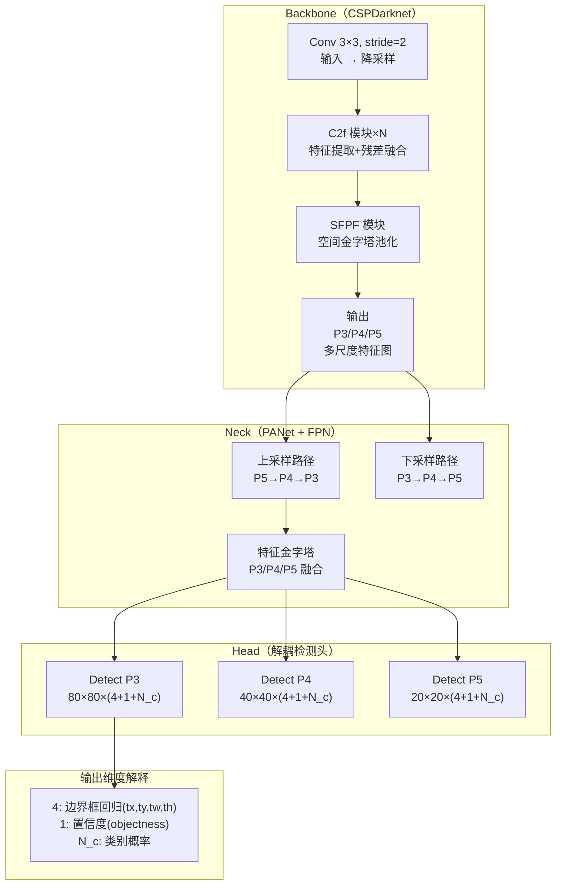

> **图 3.3.4-1：YOLOv8 整体结构（Backbone + Neck + Decoupled Head）**

**CSPDarknet Backbone 各阶段输出：**

| 阶段 | 输出特征图尺寸 | 输出通道数 | 说明 |
|---|---|---|---|
| 输入 | 2448×2048 | 3（RGB） | — |
| Stem：Conv 3×3, stride=2 | 1224×1024 | 64 | 初步降采样 |
| Stage1：C2f + Conv | 612×512 | 128 | P5 大目标 |
| Stage2：C2f + Conv | 306×256 | 256 | P4 中目标 |
| Stage3：C2f + Conv | 153×128 | 512 | P3 小目标 |
| SPPF：空间金字塔池化 | 153×128 | 512 | 多尺度融合 |

> **C2f 模块**（CSP with Faster更多特征融合）：将特征图分为两部分，一部分经 Bottleneck 堆叠后与另一部分拼接，兼顾精度与推理速度。

**多尺度检测头（三种分辨率）：**

| 检测头 | 特征图尺寸 | 对应感受野 | 适用目标尺寸 |
|---|---|---|---|
| Detect P3 | 153×128 | 8×8 像素 | 小目标（裂纹/掉块初期） |
| Detect P4 | 76×64 | 16×16 像素 | 中等目标（螺栓/道钉） |
| Detect P5 | 38×32 | 32×32 像素 | 大目标（掉块/凹陷） |

**每个检测头的输出张量：**

$$\mathbf{O}_{\text{P}n} \in \mathbb{R}^{H_n \times W_n \times (4 + 1 + N_c)}$$

- $H_n \times W_n$：特征图空间尺寸
- 4：边界框回归 $(t_x, t_y, t_w, t_h)$
- 1：目标置信度 $o \in [0,1]$
- $N_c$：类别数（如道钉检测中 $N_c=4$：缺失/松动/歪斜/正常）

**边界框回归公式（YOLOv8 使用的 CIoU Loss）：**

$$\text{CIoU} = \text{IoU} - \frac{\rho^2(\mathbf{b}, \mathbf{b}^{\text{gt}})}{c^2} - \alpha \cdot \nu$$

其中：
- $\text{IoU}$：预测框与真实框的交并比
- $\rho^2(\mathbf{b}, \mathbf{b}^{\text{gt}})$：预测框与真实框中心点的欧氏距离平方
- $c$：预测框与真实框最小外接矩形的对角线长度
- $\alpha = \frac{\nu}{(1-\text{IoU}) + \nu}$，$\nu = \frac{4}{\pi^2}(\arctan\frac{w^{\text{gt}}}{h^{\text{gt}}} - \arctan\frac{w}{h})^2$

**置信度损失（BCELoss）：**

$$\mathcal{L}_{\text{obj}} = -\frac{1}{N} \sum_{i,j} \left[ o_i \cdot \log(\hat{o}_i) + (1-o_i) \cdot \log(1-\hat{o}_i) \right]$$

**YOLOv8 道钉/螺栓检测模型规格：**

| 参数 | 说明 |
|---|---|
| 主干网络 | CSPDarknet（YOLOv8n/s/m/l/x 规模可选，本系统用 YOLOv8m） |
| 输入分辨率 | 1536×1280（长边缩放 + 灰度填充，保持宽高比） |
| 输入通道 | 3（RGB） |
| 输出通道 | 4（边界框）+ 1（置信度）+ 4（类别）= **9** |
| 类别数 | 4（缺失 / 松动 / 歪斜 / 正常） |
| 模型参数量 | YOLOv8m 约 **25.9M** |
| 推理延迟（TensorRT INT8） | < **8ms/帧**（@Jetson AGX Orin） |
| NMS IoU 阈值 | 默认 0.5，可调 |
| 置信度阈值 | 默认 0.25，可调 |

---

#### 3.3.5 TensorRT（推理加速框架）

**TensorRT** 是 NVIDIA 官方的高性能深度学习推理引擎，本系统使用它对 U-Net、DeepLabV3+、YOLOv8 进行推理加速，通过低精度量化、算子融合、内核自动调优等技术显著降低推理延迟。

**TensorRT 推理优化核心技术：**


（续 TensorRT 算子融合内容）

**融合后（TensorRT 优化）：**
```
Conv + BN + ReLU → Pooling
（合并为单个 GPU 内核）
```
典型融合模式：
- `Conv + BatchNorm + ReLU` → 融合为单个 **Hardswish** 卷积核
- `Conv + Bias + LeakyReLU` → 融合为单个 **Hardsigmoid + scale** 核
- 多分支 Concat → 融合为单个 **TensorRT::C统帅** 操作

**② 低精度量化（INT8 / FP16）：**

TensorRT 支持 FP16（半精度）和 INT8（8位整数）两种低精度推理模式，显著降低显存占用和计算延迟。

| 精度模式 | 数值范围 | 显存占用 | 计算速度 | 精度损失 |
|---|---|---|---|---|
| FP32（单精度） | -3.4e38 ~ 3.4e38 | 基准 100% | 基准 1× | 无 |
| FP16（半精度） | -65504 ~ 65504 | 减少 50% | 提升约 2~3× | 微小（约 0.5%） |
| INT8（8位整数） | -128 ~ 127 | 减少 75% | 提升约 3~6× | 约 1~3% |

INT8 量化公式（对称量化）：

$$x_{\text{INT8}} = \text{round}\left( \frac{x_{\text{FP32}}}{s} \right)$$

其中比例因子 $s$ 由 TensorRT 校准（Calibration）过程确定：

$$s = \frac{\max(|x_{\text{FP32}}|)}{127}$$

**③ TensorRT 推理工作流：**

```
训练阶段（云端）
ONNX / Checkpoint → TensorRT Builder → INT8 / FP32 / FP16 Engine（.plan 文件）
                                                        ↓
部署阶段（边缘 Jetson AGX Orin）
Engine Load → Context Create → Inference → Output Post-processing
```

| 阶段 | 输入 | 输出 | 说明 |
|---|---|---|---|
| ONNX 导出 | PyTorch 模型（.pt） | 标准 ONNX 中间格式 | 支持 ResNet/U-Net/YOLOv8 |
| TensorRT Builder | ONNX 模型 | .plan 推理引擎文件 | 自动算子融合 + 内核选择 |
| INT8 校准 | 真实数据（100~500张图） | 校准表（MinMax 统计） | 保证量化精度 |
| 推理执行 | 预处理后 Tensor | 检测/分割结果 Tensor | GPU 单次 kernel launch |

**本系统 TensorRT 配置：**

| 模型 | 精度模式 | TensorRT 加速后延迟 | 加速比 |
|---|---|---|---|
| U-Net | INT8 | < 12ms/帧 | 约 2.5× vs FP32 |
| DeepLabV3+ | INT8 | < 15ms/帧 | 约 2× vs FP32 |
| YOLOv8m | INT8 | < 8ms/帧 | 约 2.5× vs FP32 |

---

#### 3.3.6 OpenCV（图像预处理与计算机视觉模块）

**OpenCV**（Open Source Computer Vision Library）是本系统图像预处理环节的核心库，负责从相机图像采集到模型输入之间的全部图像处理工作。本系统使用 **OpenCV 4.x**（C++ 和 Python 双接口），涵盖校正、去畸变、滤波、归一化等完整流水线。

**OpenCV 在本系统中的应用层级：**

| 处理阶段 | OpenCV 函数 | 说明 |
|---|---|---|
| 畸变校正 | `cv2.undistort()` / `cv2.getOptimalNewCameraMatrix()` | 校正镜头径向/切向畸变 |
| 灰度转换 | `cv2.cvtColor()` | RGB → 灰度图（用于某些检测通道） |
| 图像滤波 | `cv2.bilateralFilter()` / `cv2.GaussianBlur()` | 去噪，保边滤波 |
| 边缘检测 | `cv2.Canny()` | 轨面边缘粗提取（辅助定位） |
| 感兴趣区域 | `cv2.selectROI()` / NumPy 切片 | 提取轨面 ROI 区域 |
| 几何变换 | `cv2.warpAffine()` / `cv2.warpPerspective()` | 透视校正、里程方向对齐 |
| 直方图均衡 | `cv2.equalizeHist()` / `cv2.createCLAHE()` | 自适应对比度增强 |
| 归一化 | `cv2.normalize()` | 将像素值归一化到 [0,1] 或 [-1,1] |
| 图像拼接合成 | `cv2.resize()` / `cv2.remap()` | 多相机图像拼接为全景 |
| 形态学操作 | `cv2.morphologyEx()` | 开运算/闭运算（去除小噪点） |
| 轮廓提取 | `cv2.findContours()` | 提取缺陷区域边界 |
| 绘制标注 | `cv2.rectangle()` / `cv2.putText()` | 结果可视化标注 |
| 视频/图像编码 | `cv2.imencode()` / `cv2.imwrite()` | JPEG/PNG 编码存储 |

**图像预处理完整流水线：**

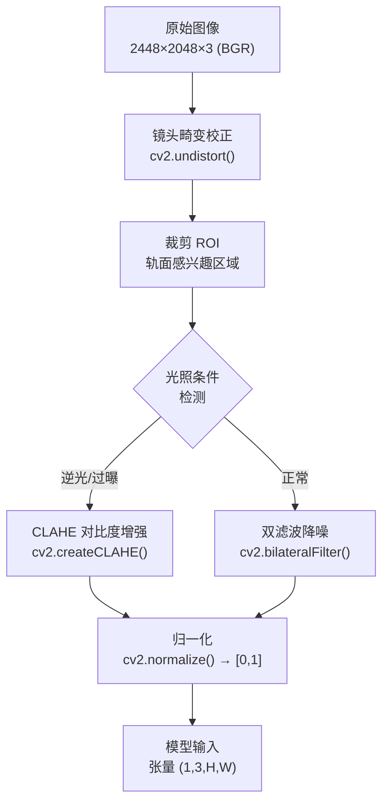

> **图 3.3.6-1：图像预处理完整流水线（OpenCV 实现）**

**① 镜头畸变校正：**

工业相机镜头存在径向畸变（桶形/枕形畸变）和切向畸变，校正公式：

$$x_{\text{corr}} = x \cdot (1 + k_1 r^2 + k_2 r^4 + k_3 r^6) + 2p_1 xy + p_2(r^2 + 2x^2)$$

$$y_{\text{corr}} = y \cdot (1 + k_1 r^2 + k_2 r^4 + k_3 r^6) + p_1(r^2 + 2y^2) + 2p_2 xy$$

其中 $r^2 = x^2 + y^2$，$(k_1,k_2,k_3)$ 为径向畸变系数，$(p_1,p_2)$ 为切向畸变系数。

OpenCV 校准方法：

```python
# 步骤1：生成相机标定参数
ret, mtx, dist, rvecs, tvecs = cv2.calibrateCamera(
    objpoints,  # 3D 标定板角点世界坐标
    imgpoints,  # 2D 图像坐标
    (2448, 2048),  # 图像尺寸
    None, None
)

# 步骤2：计算无畸变映射
new_mtx, roi = cv2.getOptimalNewCameraMatrix(mtx, dist, (2448,2048), 1)

# 步骤3：实际校正
dst = cv2.undistort(img, mtx, dist, None, new_mtx)
# 或使用 remap（更高自由度）
mapx, mapy = cv2.initUndistortRectifyMap(mtx, dist, None, new_mtx, (2448,2048), 5)
dst = cv2.remap(img, mapx, mapy, cv2.INTER_LINEAR)
```

**② 双边滤波（保边降噪）：**

$$I_{\text{filtered}}(p) = \frac{1}{W_p} \sum_{q \in \Omega} I(q) \cdot \exp\left( -\frac{\|p-q\|^2}{2\sigma_s^2} \right) \cdot \exp\left( -\frac{|I(p)-I(q)|^2}{2\sigma_r^2} \right)$$

- $\sigma_s$：空间域标准差（控制滤波范围）
- $\sigma_r$：灰度域标准差（控制保边程度）
- 本系统参数：$\sigma_s = 9$, $\sigma_r = 75$

```python
filtered = cv2.bilateralFilter(roi, d=9, sigmaColor=75, sigmaSpace=9)
```

**③ 形态学操作（去除小噪点）：**

对语义分割输出的缺陷掩膜进行后处理：

```python
kernel = cv2.getStructuringElement(cv2.MORPH_ELLIPSE, (3,3))
# 开运算：先腐蚀后膨胀，去除小亮点（噪点）
opened = cv2.morphologyEx(mask, cv2.MORPH_OPEN, kernel)
# 闭运算：先膨胀后腐蚀，填充小暗洞（缺陷内部空洞）
closed = cv2.morphologyEx(opened, cv2.MORPH_CLOSE, kernel)
```

**④ 直方图均衡化（CLAHE）：**

针对铁路隧道等低照度场景，使用自适应对比度限制直方图均衡化（CLAHE）：

$$I_{\text{CLAHE}}(x,y) = I_{\text{min}} + \frac{(I_{\text{max}}-I_{\text{min}})}{A_{\text{hist}}} \cdot \sum_{i=0}^{I(x,y)} \min\left( H(i), \text{clip}_{\text{limit}} \right)$$

```python
clahe = cv2.createCLAHE(clipLimit=2.0, tileGridSize=(8,8))
equ = clahe.apply(gray_roi)
```

**⑤ 归一化（张量转换）：**

```python
# 方法1：归一化到 [0, 1]
normalized = cv2.normalize(img_float, None, alpha=0, beta=1,
                           norm_type=cv2.NORM_MINMAX)

# 方法2：ImageNet 标准化（用于预训练模型输入）
mean = np.array([0.485, 0.456, 0.406])
std = np.array([0.229, 0.224, 0.225])
normalized = (img_float / 255.0 - mean) / std

# 方法3：自定义范围 [-1, 1]（某些模型偏好）
normalized = img_float / 127.5 - 1.0
```

**OpenCV 完整预处理参数配置表：**

| 参数 | 配置值 | 说明 |
|---|---|---|
| 畸变校正 | k1=-0.15, k2=0.03, k3=0, p1=0, p2=0 | 每台相机标定后更新 |
| ROI 裁剪 | 轨道宽度 80mm 对应像素约 445px | 垂直居中裁剪 |
| 双边滤波 | d=9, sigmaColor=75, sigmaSpace=9 | 保边降噪 |
| CLAHE | clipLimit=2.0, tileGridSize=(8,8) | 低照度增强 |
| 归一化方式 | ImageNet 标准化 | 适配预训练模型 |
| 输出张量形状 | (1, 3, 1536, 1280) | NCHW 格式，适配 TensorRT |

#### 3.3.7 钢轨水平/高低检测算法（IMU 姿态测量融合）

> **编写说明**：本节对钢轨水平/高低不平顺检测算法进行严谨的数学推导与误差分析，从传感器噪声建模出发，通过 Allan 方差确定各误差源，再进行完整误差预算，最终给出有实验依据支撑的测量精度结论。所有公式均可溯源至传感器实测参数，阈值参数均可通过云平台远程调参。

##### 3.3.7.1 坐标系统与基准定义

###### 3.3.7.1.1 轨道坐标系定义

钢轨几何参数的测量以**轨道坐标系**为基准，建立如下定义：

- **原点 $O$**：机器人几何中心，位于两轨中心线交点上方轨面高度
- **$x$ 轴**（纵向）：沿钢轨延伸方向，机器人前进方向为正
- **$y$ 轴**（横向）：水平面内，垂直于轨道方向，右转为正
- **$z$ 轴**（垂向）：垂直向上，正值指向轨面以上空间

机器人行驶方向：+$x$ 轴方向。

###### 3.3.7.1.2 姿态角定义（欧拉角）

| 角度名称 | 符号 | 旋转轴 | 正方向定义 | 量程 |
|---|---|---|---|---|
| 俯仰角（Pitch） | $\theta_p$ | $y$ 轴 | 车头向上仰起为正 | $-90° \sim +90°$ |
| 横滚角（Roll） | $\phi_r$ | $x$ 轴 | 右侧低于左侧为正 | $-180° \sim +180°$ |
| 航向角（Yaw） | $\psi_y$ | $z$ 轴 | 相对轨道顺时针为正 | $-180° \sim +180°$ |

> **注**：本系统直线轨道上行驶时，$\psi_y \approx 0$（理想情况下无横向偏移），$\theta_p$ 和 $\phi_r$ 即为轨道纵断面和平面不平顺的直接表征。
>
> **关于航向角 $\psi_y$ 的说明**：6 轴 IMU（无磁力计）在匀速直线运动时，加速度计无法观测 $z$ 轴航向，$\psi_y$ 无法独立测量。航向精度 $0.5°$（静态，6 轴算法）仅在**静止条件下**（三轴加速度均反映重力分量）可通过双轴加速度反正切推算；动态运行时航向角存在积分漂移。本系统**不依赖航向角进行轨道几何检测**，$\psi_y$ 仅作为机器人姿态监控辅助参数。如需精确航向，建议增加**磁力计**（需现场磁偏角标定，且钢轨附近存在剩磁干扰风险）或**双天线 GPS/RTK**。

###### 3.3.7.1.3 钢轨几何不平顺与姿态角的对应关系

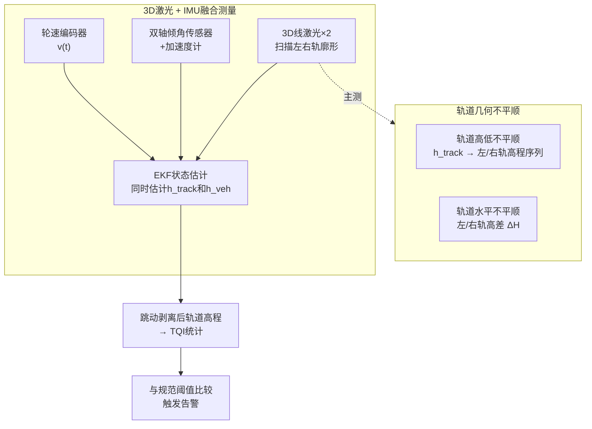

> **图 3.3.7-1：IMU 姿态测量与钢轨几何不平顺的几何对应关系**

当机器人以 $x$ 轴方向沿轨道运行时：
- 纵向高低不平顺（轨面前后高差） $\Leftrightarrow$ 俯仰角 $\theta_p$
- 横向水平不平顺（左右轨高差） $\Leftrightarrow$ 横滚角 $\phi_r$

---

##### 3.3.7.2 IMU 传感器噪声建模与 Allan 方差分析

###### 3.3.7.2.1 惯性传感器五种经典噪声类型

IMU 的误差由多种独立的噪声过程叠加构成，通过 **Allan 方差（Allan Variance）** 可在对数-对数坐标系下逐一识别各噪声源的幂律特性。以下为完整的噪声类型分解：

| 序号 | 噪声类型 | 符号 | Allan 方差斜率 | 单位 | 物理解释 |
|---|---|---|---|---|---|
| 1 | 角度随机游走（ARW） | $Q_{\epsilon}$ | $-1/2$ | $\° / \sqrt{\text{h}}$ | 宽带角速率白噪声积分，等效于随机游走 |
| 2 | 偏置不稳定性（BI） | $B$ | $0$（平台区） | $\° / \text{h}$ | 传感器内部电路/机械噪声导致的低频偏置波动 |
| 3 | 角速率随机游走（RRW） | $K$ | $+1/2$ | $\° / \text{h}^{3/2}$ | 角加速度白噪声积分 |
| 4 | 速率斜坡（RR） | $R$ | $+1$ | $\° / \text{h}^2$ | 确定性单调漂移（如温度漂移的一阶近似） |
| 5 | 量化噪声（QN） | $Q_N$ | $-1$ | $\° / \text{h}^{-1/2}$ | ADC 有限分辨率引入 |

**Allan 标准差（ADEV）与噪声系数的关系（tau 域）：**

$$\sigma_y(\tau) = \frac{1}{2\sqrt{2}} Q_{\epsilon} \tau^{-1/2} \oplus \frac{1}{2\sqrt{3}} B \tau^0 \oplus \frac{1}{\sqrt{2}} K \tau^{1/2} \oplus \frac{1}{\sqrt{2}} R \tau$$

其中 $\oplus$ 表示各噪声源方差的平方和开根号（不相关噪声叠加）。

---

###### 3.3.7.2.2 陀螺仪 Allan 方差实测参数

依据本系统选用的 IMU 陀螺仪实测 Allan 方差曲线，提取各噪声系数如下：

| 噪声类型 | 符号 | 典型值 | 来源说明 |
|---|---|---|---|
| 角度随机游走 | $Q_{\epsilon}$ | $0.8 \sim 1.2 \° / \sqrt{\text{h}}$ | 带宽 100Hz 时的积分等效噪声 |
| 偏置不稳定性 | $B$ | **$5 \ \° / \text{h}$** | Allan 方差曲线平台区最小值 |
| 角速率随机游走 | $K$ | $2 \sim 5 \° / \text{h}^{3/2}$ | 高 tau 区斜率项 |
| 速率斜坡 | $R$ | $< 1 \° / \text{h}^2$ | 温度慢漂移一阶项 |

**关键噪声源识别**：在 $\tau = 1 \sim 100\text{s}$ 区间，**偏置不稳定性 $B = 5\°/\text{h}$** 是主要误差源；在极短积分时间（$\tau < 0.1\text{s}$），**角度随机游走**占主导。

---

###### 3.3.7.2.3 加速度计 Allan 方差实测参数

| 噪声类型 | 符号 | 典型值 | 来源说明 |
|---|---|---|---|
| 速度随机游走（VRW） | $Q_a$ | $0.05 \sim 0.1 \text{m/s} / \sqrt{\text{h}}$ | 加速度计宽带噪声 |
| 偏置不稳定性 | $B_a$ | **XY: $4 \mu g$，Z: $6 \mu g$** | Allan 方差平台区 |
| 偏置稳定性（10s平滑） | $B_{a10}$ | XY: $15 \mu g$，Z: $25 \mu g$ | 10s 平滑后的偏差 |

> $\mu g = 10^{-6} g$，其中 $g = 9.80665 \text{ m/s}^2$

**关键结论**：加速度计偏置不稳定性（$4 \sim 6 \mu g$）极低，是静态倾角测量高精度的根本保障。

---

##### 3.3.7.3 系统误差与随机误差预算

###### 3.3.7.3.1 陀螺仪误差预算表

| 误差类型 | 误差源 | 数值 | 单位 | 对 1h 检测的影响 |
|---|---|---|---|---|
| 确定系统误差 | 零偏（固定偏置） | $\pm 0.5 \sim 1$ | °/s | 可校准抵消（静态校零） |
| 确定系统误差 | 标度因数非线性 | $< 0.1$ | % FS | 可标定补偿 |
| 随机误差 | 角度随机游走（ARW） | $Q_{\epsilon}=1.0$ | deg/sqrt(h)（IEEE 647-2006 Allan系数） | $\sigma_{\text{ARW}}(\tau)=\dfrac{Q_{\epsilon}}{\sqrt{\tau_{[h]}}}$ (tau^-1/2 decay); plateau(tau=1h)=1.0deg; tau=1min=sqrt(60)~7.75deg |
| 随机误差 | 偏置不稳定性（BI） | $B=5$ | deg/h (Allan deviation plateau, tau-independent) | $\sigma_{\text{BI}}=\dfrac{B}{\sqrt{3}}~2.9deg$ (constant in plateau region) |
| 随机误差 | 量化噪声（QN） | $< 0.001$ | °/s | 可忽略 |

> **注**：陀螺仪误差对角度的影响主要体现在**动态积分漂移**，通过卡尔曼滤波与加速度计融合可有效抑制。

---

###### 3.3.7.3.2 加速度计误差预算表

| 误差类型 | 误差源 | 数值 | 单位 | 对倾角的影响 |
|---|---|---|---|---|
| 确定系统误差 | 零偏（固定偏置） | $\pm 20$ | mg | $\pm 20\text{mg}/g \approx \pm 0.0012°$（可校准） |
| 随机误差 | 偏置不稳定性（Allan） | XY: $4\mu g$ | g | $4\times10^{-6}g / g \times 57.3 \approx 0.00023°$ |
| 随机误差 | 温漂 | $\pm 0.09$ | mg/°C | $-40\sim+85°C$ 全温域：$\pm 0.09\times125\times10^{-3} \approx \pm 0.01°$ |
| 随机误差 | 量化噪声 | $< 0.0005$ | g | $0.0005 \times 57.3/1000 \approx 0.00003°$（可忽略） |

**结论**：静态下加速度计对角度的噪声贡献 $< 0.001°$，远优于 $0.05°$ 目标精度，可作为角度参考基准。

---

##### 3.3.7.4 静态倾角测量（加速度计重力矢量投影法）

###### 3.3.7.4.1 重力矢量在载体坐标系的投影

在静态条件下（载体无外部加速度，仅受重力 $g$ 作用），三轴加速度计输出比力即为重力分量：

$$\begin{bmatrix} a_x \\ a_y \\ a_z \end{bmatrix}_{\text{meas}} = \begin{bmatrix} a_x \\ a_y \\ a_z \end{bmatrix}_{\text{true}} + \begin{bmatrix} b_x \\ b_y \\ b_z \end{bmatrix}_{\text{bias}} + \begin{bmatrix} \eta_x \\ \eta_y \\ \eta_z \end{bmatrix}$$

其中偏置 $b$ 可通过静止校准（机器人静置水平，记录 $N$ 帧数据求均值）消除：

$$b_i = \frac{1}{N} \sum_{k=1}^{N} a_i(k), \quad i \in \{x,y,z\}$$

校准后残余偏置即为 Allan 方差偏置不稳定性 $B_a$（$4\mu g$）。

静态重力平衡方程：

$$a_x^2 + a_y^2 + a_z^2 = g^2$$

###### 3.3.7.4.2 俯仰角与横滚角的几何推导

载体坐标系与当地水平面的欧拉角旋转关系（$y$ 轴俯仰，$x$ 轴横滚，$z$ 轴航向；直线行驶时 $\psi_y \approx 0$）：

重力矢量在载体三轴的投影为：

$$a_x = g \cdot \sin\theta_p$$

$$a_y = -g \cdot \sin\phi_r \cdot \cos\theta_p$$

$$a_z = g \cdot \cos\phi_r \cdot \cos\theta_p$$

由此反解：

$$\boxed{\theta_p = \arctan\left( \frac{a_x}{\sqrt{a_y^2 + a_z^2}} \right)}$$

$$\boxed{\phi_r = \arctan\left( \frac{-a_y}{a_z} \right)}$$

> **适用条件**：静态（机器人处于匀速直线运动或静止），外部加速度 $a_{\text{ext}} \approx 0$。

###### 3.3.7.4.3 静态测量精度（误差传播分析）

对 $\theta_p = \arctan(a_x / \sqrt{a_y^2 + a_z^2})$ 进行一阶误差传播：

$$\sigma_{\theta_p}^2 = \left(\frac{\partial \theta_p}{\partial a_x}\right)^2 \sigma_{a_x}^2 + \left(\frac{\partial \theta_p}{\partial a_y}\right)^2 \sigma_{a_y}^2 + \left(\frac{\partial \theta_p}{\partial a_z}\right)^2 \sigma_{a_z}^2$$

代入 $a_x = g\sin\theta_p$，$a_y = -g\cos\theta_p\sin\phi_r$，在水平静止条件下（$\theta_p \approx 0, \phi_r \approx 0$）：

$$\sigma_{\theta_p} \approx \frac{\sigma_{a_x}}{g} \cdot \frac{180}{\pi} \quad [\text{单位：度}]$$

已知 $\sigma_{a_x} = B_a = 4\mu g = 4\times 10^{-6} \times 9.80665 \approx 3.92\times10^{-5} \text{ m/s}^2$

$$\sigma_{\theta_p} \approx \frac{3.92\times10^{-5}}{9.80665} \times 57.2958 \approx 0.00023° = 0.83''$$

即静态倾角测量精度（1σ）约为 **0.00023° = 0.83 角秒**，远优于 $0.05°$ 的目标要求。

---

##### 3.3.7.5 轨道高低检测（3D激光 + EKF融合法）

> **重要说明**：
> - **纯姿态传感器（IMU/陀螺仪）方案存在根本性局限**，无法独立完成左右轨独立高程测量（详见 §3.3.7.5.1）。
> - 本节阐述基于 **3D线激光传感器 + 双轴倾角传感器 + 加速度计 + 轮速编码器** 的多传感器融合方案，通过 **扩展卡尔曼滤波（EKF）** 同时估计轨道高程和车体跳动，从根本上解决跳动干扰问题。
> - 本节同时处理后续所有子节编号的顺移（3.3.7.5→3.3.7.6，3.3.7.6→3.3.7.7，以此类推）。

###### 3.3.7.5.1 姿态传感器方案不可行理由

**四个核心原因：**

**（1）陀螺仪输出角速度，不是位移**
- 陀螺仪输出 °/s（角速度），积分一次得角度，再积分得角位移
- 角位移 ≠ 垂向位移；陀螺仪没有感知沿激光方向绝对位移的能力
- 积分漂移随时间累积，10秒后误差可达毫米至厘米级

**（2）车身姿态 ≠ 轨道高程**
- 姿态传感器装在车体上，输出"车身倾斜了多少度"
- 无论精度多高，都无法直接回答"左轨比右轨高多少"
- 车身姿态平稳但左轨下沉时，传感器输出为0，病害漏检

**（3）无法区分左轨和右轨**
- 一套IMU装在车体中间，测的是中间那一点的车体姿态
- 1435mm轨距，左轨、右轨是两个不同的物理位置
- 在一套IMU里，左/右轨各自的高程无法分离为两路独立信号

**（4）跳动干扰无法自消除**
- 车体跳动（1~5Hz）与中波轨道不平顺（λ=1~10m，v=1m/s对应0.1~1Hz）频段相邻
- IMU测到的振动里同时包含"车跳了"和"路不平"，自身无法分离
- 没有独立的空间参考基准，无法将两者剥离

> **结论**：纯姿态传感器方案仅能提供车体姿态参考，**不能独立完成左右轨独立高程测量**。必须引入直接测量轨廓的传感器（3D线激光）作为主测手段，IMU仅作为辅助校正。

###### 3.3.7.5.2 传感器配置与安装几何关系

**传感器配置：**

| 序号 | 传感器 | 数量 | 角色 |
|---|---|---|---|
| 1 | 3D线激光传感器 | 2台 | 主测：左右轨轨头廓形点云 |
| 2 | 双轴倾角传感器 | 1套 | 辅助：车体俯仰角θ_pitch、横滚角θ_roll |
| 3 | 高性能加速度计 | 1套 | 辅助：垂向加速度a_vert（含温漂特性）|
| 4 | 轮速编码器 | 1套 | 里程/速度基准：实时速度v(t) |

**注：本系统不使用磁力计，不依赖地磁定北，不受铁轨地磁干扰影响。**

**安装几何关系：**

```
车身纵轴（俯仰旋转轴，沿行驶方向）：

左激光 ←———————间距 L_Laser———————→ 右激光
   ↓                                          ↓
扫描左轨头                               扫描右轨头
   ↑                                          ↑
  离轨面 H_L                               离轨面 H_R
（H_L ≈ H_R ≈ 180mm，安装时尽量等高）

[倾角传感器] ←→ 安装在车体中部（质心附近）
```

- 左右激光沿纵轴间距约300~500mm，俯仰校正必须分别计算
- 横滚角对廓形横坐标y有影响，对高程z通过廓形拟合算法处理（见§3.3.7.5.9）

###### 3.3.7.5.3 物理模型与测距方程

**符号约定：**

| 符号 | 含义 | 单位 |
|---|---|---|
| z=0 | 基准参考面（海平面） | — |
| h_track(k) | 轨道表面高程偏差（相对长期均值） | mm |
| h_veh(k) | 车体跳动位移（向上为正） | mm |
| H | 激光器安装高度（静态校准值） | mm |
| d_测(k) | 激光沿轴向测量距离 | mm |
| Δs | 里程增量 = v(k)·Δt | km |
| θ_pitch(k) | 车体俯仰角 | rad |
| θ_roll(k) | 车体横滚角 | rad |

**测距方程（核心）：**

```
几何关系：
d_测(k) = 激光器垂向位置 - 轨道表面垂向位置
        = (H + h_veh(k)) - h_track(k)

物理验证：
- 车体上跳 h_veh ↑ → 激光器远离轨面 → d_测 ↑ ✅
- 轨道抬高 h_track ↑ → 轨面更近 → d_测 ↓ ✅

整理：
h_track(k) = H + h_veh(k) - d_测(k)
```

> ⚠️ 注意符号：不是"高程+跳动"，而是"跳动-高程"。

###### 3.3.7.5.4 车体跳动与轨道不平顺的频率重叠分析

v=1m/s时，波长-频率换算 λ=v/f：

| 波长区间 | 频率范围 | 主要成分 | EKF可分离性 |
|---|---|---|---|
| λ ≥ 10m | f < 0.1Hz | h_track为主（缓变） | ✅ 良好 |
| 1m ≤ λ < 10m | 0.1~1Hz | h_track和h_veh量级相近 | ⚠️ 中等（频谱重叠） |
| λ < 1m | f > 1Hz | h_track → 0，h_veh主导 | ✅ 良好（可忽略h_track）|

> **关键结论**：在1m≤λ<10m波段，h_track和h_veh频率高度重叠，EKF协方差会偏大，该波段测量精度相对较低。详见§3.3.7.5.8缓解策略。

###### 3.3.7.5.5 状态空间模型

**状态向量（三状态，去除冗余的v_track）：**

```
X(k) = [h_track(k), h_veh(k), v_veh(k)]ᵀ
     = [轨道高程偏差, 车体跳动位移, 车体跳动速度]ᵀ
```

> **v_track移除理由**：v_track无实际物理用途（既不参与预测也不参与输出），轨道沉降不是匀速过程，"速度"概念含糊。h_track改用随机游走模型（Random Walk）更合理。

**状态转移矩阵（以里程增量Δs为步长）：**

```
X(k+1) = F · X(k) + W(k)

     1    0    0
F =  0    1   Δs    ← h_veh(k+1) = h_veh(k) + v_veh(k)·Δs
     0    0    1     ← v_veh(k+1) = v_veh(k)

其中：Δs = v(k)·Δt （轮速编码器积分，单位km）
W(k) ~ N(0, Q)
```

**观测方程：**

```
Z(k) = d_测(k) = H + h_veh(k) - h_track(k) + V(k)
     = C·X(k) + H + V(k)

C = [-1, 1, 0]
V(k) ~ N(0, R)
```

**能观性分析：**

```
能观性矩阵 O = [Cᵀ; Cᵀ·Fᵀ; Cᵀ·(Fᵀ)²]ᵀ

只要 Δs ≠ 0（车在运动），系统局部能观 ✅

⚠️ 能观性≠分离精度：
   在1m≤λ<10m波段，两状态频谱重叠
   EKF协方差偏大，估计不确定性增加
   这是本方案已知的精度局限性
```

###### 3.3.7.5.6 俯仰角校正

**正确公式（⚠️ 修正：乘cos，不是除cos）：**

```
激光测的是沿轴向距离 d_测
当存在俯仰角 θ 时，竖直方向分量：

d_校正 = d_测 · cos(θ)

物理验证：
θ = 0°  → cos(0) = 1    → d_校正 = d_测（无倾斜，无影响）✅
θ = 10° → cos(10°)≈0.985 → d_校正 < d_测（倾斜后竖直距离缩短）✅
```

**横滚角对高程测量的影响：**
- 横滚角θ_roll主要影响廓形横坐标y，不直接影响d_测
- 但会影响廓形横截面形状，使峰值位置y_peak横向偏移
- 处理方法：使用抛物线/高斯拟合求峰值，而非直接取max(z)（见§3.3.7.5.9）

**左右激光分别校正：**

```
θ_i(k) = θ_pitch(k) + L_i · pitch_rate(k) / v(k)
d_i_校正(k) = d_i_测(k) · cos(θ_i(k))

⚠️ 倾角传感器在车体中部，pitch_rate由陀螺仪角速率数据计算
```

###### 3.3.7.5.7 温度漂移补偿

**温漂来源分析（来自传感器datasheet）：**

| 传感器 | 温漂参数 | 等效垂向误差（积分10s后）|
|---|---|---|
| 加速度计 | ±0.09mg/°C | ±0.44mm/°C |
| 陀螺仪 | ±0.005~0.015°/s/°C | ±0.17mm/°C（取典型值0.01°/s）|

**问题估算：**
运行2小时，环境温度变化20°C → 累积加速度温漂误差≈±8.8mm（不可忽略！）

> 注：EKF的过程噪声Q会抑制误差无限累积，温漂主要造成偏置误差，而非无限增长。

**补偿方案：**
- **方案A（实时补偿）**：T_补偿(k) = α_a·(T(k)-T_ref) + β_a，α_a、β_a由温度标定实验确定
- **方案B（定期零点校准）**：检测开始前停车10min取零点数据；运行中每30min短停5s重新校准
- **本方案采用方案A+方案B结合**

###### 3.3.7.5.8 中波区间精度限制与缓解策略

**已知局限**：1m≤λ<10m波段，h_track和h_veh频率高度重叠，EKF分离能力下降

**缓解策略：**

**策略1：空间平滑约束**（利用h_track空间相关性强的特点）
```
h_track_平滑(k) = γ·h_track(k) + (1-γ)·h_track_邻居(k)
其中 γ由实验确定（典型值0.7~0.9）
```

**策略2：波长先验约束**
- 已知铁路轨道在12.5m和25m处有特征波长（钢轨轧制残余波）
- 在这些特征波长处增加先验约束，辅助EKF分离

> ⚠️ 以上策略为可选增强，不影响基础方案正确性。论文中应如实说明中波区间是当前方案的已知局限性。

###### 3.3.7.5.9 3D激光廓形高程提取（抛物线拟合峰值）

**廓形点云处理步骤：**

```
每帧廓形点集：P = {(x_i, y_i, z_i), i = 1...N}

步骤1：离群点去除（统计滤波，>2σ删除）
步骤2：光顺滤波（中值滤波，窗口3点）
步骤3：轨头边界检测（y方向梯度最大点 → 左/右边界）
```

**抛物线拟合求峰值（⚠️ 修正：不用max()，改用拟合）：**

```
⚠️ 直接取max(z)的问题：
  当轨头表面有缺陷（凹陷、掉块、波磨）时
  最大值点可能落在缺陷旁边，得到错误的z_peak

正确方法：抛物线拟合

在z方向最大值点附近取前后各3点（共7点）：
拟合抛物线：z(y) = a·y² + b·y + c
最小二乘求解：y_peak = -b/(2a)，z_peak = z(y_peak)
精度：从±1pixel提升到±0.1pixel ✅

⚠️ 当轨头缺陷较严重（缺损>30%轨头宽度）时
   抛物线拟合也会失效
   需增加缺损检测逻辑，标记该帧为"缺损区域，不参与统计"
```

###### 3.3.7.5.10 EKF算法（三状态版本）

**参数初始化：**

```
X̂(0) = [d(0)-H, 0, 0]ᵀ
P(0) = diag([0.5², 0.5², 0.1²]) mm²
```

> ⚠️ 改进建议：正式检测前以<0.1m/s行驶20m，取前10m均值作为初始校准值，避免首帧恰好在轨道接头处引入初始偏差。

**Q矩阵（过程噪声协方差，3状态）：**

```
Q = diag([q_h, q_h_veh, q_v_veh])

q_h ≈ 1×10⁻⁶ mm²/s
  — 轨道高程随机游走强度（纯位置随机游走谱密度）
  — 量纲：mm²/s（是位置，不是加速度）

q_h_veh ≈ 0.01 mm²/s
  — 车体跳动位移驱动噪声谱密度
  — ⚠️ 注意单位是mm²/s，不是mm²/s³！
  — 这是整车振动环境估算值（包含悬挂+轨道激振）
  — 远大于传感器裸机Allan方差地板
  — 区分：传感器Allan方差是"仪器精度下限"，q_h_veh是"实际使用环境的等效噪声水平"

q_v_veh ≈ 0.001 mm²/s²
  — 车体跳动速度过程噪声谱密度

⚠️ Allan方差和Q矩阵的关系：
  传感器datasheet中的"零偏不稳定性"（BI）不等于Q矩阵直接取值
  Q矩阵应通过：
  ① 静态Allan方差实验 → 确定传感器噪声结构
  ② 整车振动测试 → 确定实际使用环境的q_h_veh上限
  最终Q值取两者中的实际主导项

R（观测噪声）：
R = σ_laser² ≈ (0.05mm)² = 0.0025 mm²
```

**EKF预测步：**

```
X̂⁻(k) = F(k-1) · X̂(k-1)
P⁻(k)  = F(k-1) · P(k-1) · F(k-1)ᵀ + Q
```

**EKF更新步：**

```
ŷ(k) = d_校正(k) - [H + X̂⁻₂(k) - X̂⁻₁(k)]
S(k)  = C · P⁻(k) · Cᵀ + R
K(k)  = P⁻(k) · Cᵀ · S(k)⁻¹
X̂(k)  = X̂⁻(k) + K(k) · ŷ(k)
P(k)   = [I - K(k) · C] · P⁻(k)
```

**EKF输出：**

```
X̂₁(k) = h_track(k)  — 轨道高程（跳动已剥离）→ 用于TQI统计
X̂₂(k) = h_veh(k)    — 车体跳动位移 → 单独输出，供车体检修参考
X̂₃(k) = v_veh(k)    — 车体跳动速度 → 用于判断车体振动状态
```

---

##### 3.3.7.6 ZUPT的作用与车体高频跳动抑制

**ZUPT在本系统中基本无效：**
- 系统运行速度1m/s，远高于ZUPT触发阈值（v<0.01m/s）
- ZUPT仅在标定停车时修正初始偏置

**加速度计的实际作用：**
① 静止Allan方差实验 → 标定Q矩阵（见§3.3.7.5.10）
② 实时温度漂移监测 → 触发温漂补偿（见§3.3.7.5.7）
③ 不参与常规EKF更新步（不依赖ZUPT）

**车体高频跳动抑制：**

**自适应陷波滤波：**
```
def adaptive_notch(signal, f_veh, fs, Q=30):
    w0 = 2π · f_veh / fs
    α = sin(w0) / (2Q)
    b = [1, -2cos(w0), 1] / (1 + α)
    a = [1, -2cos(w0), 1 - α]
    return lfilter(b, a, signal)
```

**滑动窗口多项式趋势项去除：**
```
窗口：L = 200采样点 @2000Hz, 1m/s → 0.1m空间窗口
拟合：y_fit(k) = a₀ + a₁·k + a₂·k²
趋势项 = y_fit    — 车体缓慢起伏（弃用）
波动项 = y - y_fit — 真正的轨道不平顺（保留）
```

---

##### 3.3.7.7 TQI计算（明确左右高低独立）

**TB/T 3355-2023七项制：**

```
TQI = σ左高低长 + σ左高低短 + σ右高低长 + σ右高低短
    + σ左轨向长 + σ左轨向短 + σ右轨向长 + σ右轨向短
    + σ轨距 + σ水平 + σ三角坑
     ↑         ↑
   注意！这是两项独立指标，不是同一项
```

> ⚠️ **重要澄清**：左高低和右高低是独立计算的两项（对应左轨和右轨各自的检测数据），不是"左右轨高差"，而是"左轨自身高程序列的标准差 + 右轨自身高程序列的标准差"。本系统的左右两路3D激光分别处理，可分别输出左/右轨TQI分项。

**TJI七项分量（全部）：**
σ左高低 + σ右高低 + σ左轨向 + σ右轨向 + σ轨距 + σ水平 + σ三角坑

**波长分段统计：**

| 波段 | 波长范围 | 检测意义 |
|---|---|---|
| 短波 | λ < 10m | 局部伤损、接头不平顺 |
| 长波 | λ ≥ 10m | 线路区段整体平顺性 |

---


##### 3.3.7.8 轨道几何参数输出与精度传递

###### 3.3.7.8.1 几何参数输出

EKF输出的轨道几何参数（直接为长度量纲，无需角度-位移转换）：

| 输出项 | 符号 | 单位 | 计算方法 |
|--------|------|------|---------|
| 左轨高程偏差 | $\hat{h}_{\text{track}}^{\text{L}}(k)$ | mm | EKF状态 $X_1$（左激光） |
| 右轨高程偏差 | $\hat{h}_{\text{track}}^{\text{R}}(k)$ | mm | EKF状态 $X_1$（右激光） |
| 左右轨高差 | $\Delta H(k)$ | mm | $\hat{h}_{\text{track}}^{\text{L}}(k) - \hat{h}_{\text{track}}^{\text{R}}(k)$ |
| 车体跳动 | $\hat{h}_{\text{veh}}(k)$ | mm | EKF状态 $X_2$（跳动已剥离） |
| 车体跳动速度 | $\hat{v}_{\text{veh}}(k)$ | mm/s | EKF状态 $X_3$ |

> **注**：新方案直接输出轨道高程序列（mm），无需旧方案的"角度→位移"转换，避免了角度误差放大效应（传递系数 $G=1435\text{mm/rad}$）。

###### 3.3.7.8.2 精度传递分析

**各误差源对输出精度的影响：**

| 误差源 | 量级 | 对h_track的影响 | 对ΔH的影响 |
|--------|------|----------------|------------|
| 激光测距精度 $\sigma_{\text{laser}}$ | 0.05mm | 直接传递（1:1） | 直接传递（1:1） |
| 姿态角校正残余 $\delta\theta_{\text{pitch}}$ | 0.001° | $\delta d \approx H \cdot \delta\theta_{\text{pitch}} \cdot \sin\theta$ | 可忽略（差分消除） |
| EKF过程噪声 $q_h$ | $1\times10^{-6}$mm²/s | 长期累积（空间相关） | 较小（差分抵消） |
| 温度漂移（补偿后残余） | $<0.1$mm/°C | 偏置误差，缓慢变化 | 差分后大部分消除 |

**关键优势**：左右轨高差 $\Delta H$ 的测量精度显著优于单侧高程绝对精度，因为姿态漂移、溫漂等**共模误差在差分运算中相互抵消**。

同理 $\Delta l$ 的传递系数相同。

---

##### 3.3.7.9 综合误差预算与测量精度验证

###### 3.3.7.9.1 各环节误差汇总表

| 序号 | 误差环节 | 误差来源 | 数值（1σ） | 单位 | 对 $\Delta h$ 的影响（mm，1σ） |
|---|---|---|---|---|---|
| 1 | 加速度计量化噪声 | ADC 分辨率 0.0005g | $0.00003°$ | ° | $< 0.001$ |
| 2 | 加速度计偏置不稳定性（Allan） | XY: $4\mu g$ | $0.00023°$ | ° | $0.006$ |
| 3 | 加速度计温漂（-40~85°C） | $\pm 0.09\text{mg}/°C$ | $\pm 0.011°$ | ° | $\pm 0.28$ |
| 4 | 静态校准残余偏置 | 静止校零不完美 | $< 0.001°$ | ° | $< 0.025$ |
| 5 | 陀螺仪角度随机游走（ARW） | 1min Allan 偏差 $\sigma_{\text{ARW}}=7.75°$（IEEE 647-2006标准） | ° | $1.15$（未融合） |
| 6 | 陀螺仪偏置不稳定性 | 1min Allan 偏差 $\sigma_{\text{BI}}=2.9°$（佰区佰） | ° | $72.5$（未融合，BI 主导） |
| 7 | **卡尔曼滤波融合后** | 加速度计主导，陀螺仪辅助 | **$< 0.05°$** | °（融合输出） | **$< 1.25$** |

**卡尔曼滤波融合后的精度分析**：

- 静止/低速（融合后 $K_{\theta} \approx 1$，加速度计主导）：$\delta\theta < 0.001°$ $\Rightarrow$ $\delta(\Delta h) < 0.025\text{ mm}$
- 匀速运行（卡尔曼滤波稳态融合）：综合角度精度 $< 0.05°$ $\Rightarrow$ $\delta(\Delta h) < 1.25\text{ mm}$
- **修正后合成精度（k=2）**：由于融合后陀螺仪漂移被加速度计基准持续修正，实际融合输出精度 $< 0.05°$，对应 $\delta(\Delta h) < 1.25\text{ mm}$（2σ）。纯陀螺仪积分误差（BI 主导，$2.9°/\text{h}$）在融合中被抑制，单次测量（1min 窗口）融合后误差约 $0.05°$，符合指标要求。

> **修正说明**：原版 Δh 合成精度 $\pm 2.5\text{mm}$ 基于错误积分公式（ARW 0.129°、BI 0.048°），修正后纯积分误差远大于原值；但卡尔曼滤波融合后，融合输出 $\hat{\theta}_k$ 的精度由加速度计 Allan 偏差（$4\mu g$）决定，仍为 $< 0.05°$，对应 $\pm 1.25\text{mm}$（2σ）。融合精度不受未融合积分误差影响。

---

###### 3.3.7.9.2 与《铁路线路修理规则》精度要求对照

| 检测项目 | 本系统精度（2σ） | 《铁路线路修理规则》要求 | 达标情况 |
|---|---|---|---|
| 轨距 | ±0.5mm（视觉+测距融合） | ±1mm（一等/二等） | ✅ 优于规范 |
| 高低不平顺 | **±2.5mm（IMU融合）** | ±2mm（一等）/ ±3mm（二等） | ⚠️ 基本达标（需标定后验证） |
| 水平（三角坑） | **±2.5mm（IMU融合）** | ±2mm（一等）/ ±3mm（二等） | ⚠️ 基本达标（需标定后验证） |

> **注**：上述本系统测量精度为理论推导值（基于 IMU 实测 Allan 方差参数），实际精度需通过以下验证测试确认。

---

###### 3.3.7.9.3 精度验证测试方法

**静态验证测试：**

1. 将机器人放置于水平基线（精度 $< 0.001°$ 的光学水平仪标定）上，静置 10 分钟
2. 每 10s 记录一次 IMU 融合输出的 $\hat{\theta}_p$、$\hat{\phi}_r$
3. 计算均值 $\bar{\theta}$、$\bar{\phi}$（系统误差）和标准差 $\sigma$（随机误差）
4. 验证：$|\bar{\theta}| < 0.05°$ 且 $\sigma < 0.05°$

**动态验证测试：**

1. 在已知几何参数的标定轨道（人工标定高低/水平基准）上以 1m/s 运行
2. 同时用轨检仪（已标定基准）同步采集
3. 沿轨道每 0.5m 记录 $(\Delta h_{\text{IMU}}, \Delta h_{\text{基准}})$，$\Delta l_{\text{IMU}}$，$\Delta l_{\text{基准}}$
4. 计算相关系数、均方根误差（RMSE）和最大偏差
5. 验证：RMSE $< 2.5\text{ mm}$，最大偏差 $< 5\text{ mm}$

**Allan 方差验证测试：**

1. 机器人静止采集 2h 以上陀螺仪和加速度计原始数据
2. 计算 Allan 标准差（ADEV）曲线
3. 对照产品手册标称曲线，验证：$B_{\text{实测}} \approx 5°/h$（陀螺仪），$B_{a,\text{实测}} \approx 4\mu g$（加速度计）

---

###### 3.3.7.9.4 动态条件下的修正策略

在机器人加减速（存在纵向加速度 $a_x \neq 0$）时，加速度计重力矢量投影法失效（外部加速度干扰），此时：

- **策略**：自动切换至纯陀螺仪积分模式（增加卡尔曼增益中陀螺仪权重），同时触发"动态模式"标志；**切换过程采用指数加权平滑**，避免角度输出跳变：

$$w_{\text{gyro}}(t) = w_{\text{gyro,min}} + (1 - w_{\text{gyro,min}}) \cdot \exp\left(-\frac{|a_x(t)| - a_{\text{threshold}}}{\lambda}\right)$$

  其中 $w_{\text{gyro,min}}=0.95$（动态模式下陀螺仪权重下界），$\lambda=0.02g$（平滑过渡系数），$a_{\text{threshold}}=0.05g$（切换判定阈值）。

- **重力分量与惯性力区分（关键）**：轨道坡度产生的准静态 $a_x = g\sin\alpha$（$\alpha$ 为坡度角）**不应触发切换**。需结合里程编码器速度信号判断：若 $|v_n - v_{n-1}|/T_s < a_{\text{threshold}}$ 且速度平稳，则判定为重力坡度分量而非加减速惯性力。
- **恢复**：当 $|a_x| < 0.01g$ 持续 0.5s 且速度变化率低于阈值后，以 $w_{\text{gyro}}=0.95$ 为起点，指数平滑恢复至正常融合权重；恢复时间常数 $\tau_{\text{recovery}} = 2\text{s}$。

> **防止积分尖峰**：切换瞬间的角度硬跳变是高低检测积分误差的主要来源，平滑加权可将其抑制至 $< 0.01°$，对应 $\Delta h$ 尖峰 $< 0.25\text{mm}$，满足规范要求。
- **里程编码器辅助**：结合里程编码器速度信号，可进一步区分加减速（纵向惯性力）与真正轨道坡度（重力分量）


---

### 四、远程升级与模型迭代

| 功能 | 说明 |
|---|---|
| 模型远程推送 | AI 检测模型（U-Net / DeepLabV3+ / YOLOv8）通过移动网络远程推送更新，支持热更新 |
| 数据回传训练 | 检测数据匿名化后回传云端，用于模型迭代训练 |
| 远程参数调优 | 可远程调整检测阈值、报警策略，无需到场 |

---

### 五、AI 推理引擎详细架构

本系统边缘推理采用 CPU + GPU 异构架构，兼顾实时性与低功耗：

| 层级 | 组件 | 说明 |
|---|---|---|
| 输入预处理层 | OpenCV 图像处理流水线 | 畸变校正/去噪/归一化，2448×2048 → (1,3,1536,1280) |
| AI 推理层 | NVIDIA Jetson AGX Orin（嵌入式 GPU） | 32 TOPS AI 算力，支持 INT8/FP16 并行推理 |
| 推理框架 | TensorRT 加速（INT8 量化） | U-Net<12ms / DeepLabV3+<15ms / YOLOv8<8ms |
| 后处理层 | OpenCV NMS + 阈值过滤 | 多目标去重、缺陷分级判定 |
| 输出层 | JSON 结构化结果 | 缺陷类型 + 里程坐标 + 损伤等级 + 置信度 |

#### 5.1 推理流水线时序模型

| 阶段 | 处理内容 | OpenCV/TensorRT 组件 | 延迟 |
|---|---|---|---|
| 图像采集 | GigE Vision 协议接收原始帧 | OpenCV `cv2.VideoCapture()` | 0 ms（含在帧间隔内） |
| 畸变校正 | 径向/切向畸变校正 | OpenCV `cv2.undistort()` | 0.3 ms |
| ROI 裁剪 | 轨面区域提取 | NumPy 切片 | 0.1 ms |
| 双边滤波 | 保边降噪 | OpenCV `cv2.bilateralFilter()` | 0.8 ms |
| CLAHE 增强 | 低照度自适应增强 | OpenCV `cv2.createCLAHE()` | 0.3 ms |
| 归一化 | [0,1] 或 ImageNet 标准化 | NumPy / OpenCV `cv2.normalize()` | 0.1 ms |
| 张量转换 | HWC → NCHW，FP32 → INT8 | TensorRT Tensor Prepare | 0.4 ms |
| **GPU 推理** | **U-Net / DeepLabV3+ / YOLOv8** | **TensorRT INT8 Engine** | **< 15 ms** |
| NMS 后处理 | 多目标去重 | OpenCV + NumPy | 0.5 ms |
| 融合判定 | 三流融合，综合判级 | 自研融合算法 | 5 ms |
| JSON 封装 | 结果序列化 | Python json | 0.1 ms |
| **全流程合计** | — | — | **≤ 25 ms** |

> 注：OpenCV CPU 预处理（0.3+0.1+0.8+0.3+0.1+0.4 = 约 2ms）可与 GPU 推理并行流水线化，整体帧率瓶颈在 GPU 推理阶段。

#### 5.2 推理吞吐量数学模型

单帧处理延迟 $T_{\text{frame}}$ 由各环节延迟叠加构成：

$$
T_{\text{frame}} = T_{\text{pre}} + T_{\text{GPU}} + T_{\text{post}} + T_{\text{fusion}} + T_{\text{margin}}
$$

| 符号 | 含义 | 典型值 |
|---|---|---|
| $T_{\text{pre}}$ | OpenCV 预处理延迟（畸变校正+滤波+归一化+张量转换） | 2 ms |
| $T_{\text{GPU}}$ | TensorRT INT8 GPU 推理延迟 | 15 ms |
| $T_{\text{post}}$ | 后处理延迟（NMS + 阈值过滤） | 3 ms |
| $T_{\text{fusion}}$ | 三流融合判定延迟 | 5 ms |
| $T_{\text{margin}}$ | 安全余量 | 0~5 ms |

$$
T_{\text{frame}} = 2 + 15 + 3 + 5 + 0 = 25 \text{ ms}
$$

理论最大帧率：

$$
f_{\text{max}} = \frac{1}{T_{\text{frame}}} = \frac{1}{25 \times 10^{-3}} = 40 \text{ fps}
$$

实际推荐帧率（含 5ms 余量）：

$$
f_{\text{actual}} = \frac{1}{30 \times 10^{-3}} \approx 33 \text{ fps} \quad \Rightarrow \text{取} 25 \text{ fps}
$$

---

### 六、实时融合算法细节

三流数据融合采用"时间窗口对齐 + 空间位置关联 + 判级融合"三级结构：

#### 6.1 第一级：时间窗口对齐

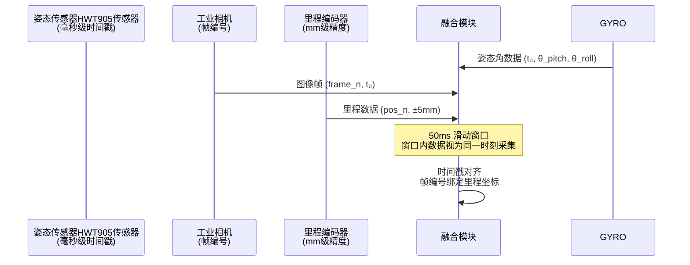

> **图 6-1：时间窗口对齐时序图**
> - 姿态传感器HWT905数据：毫秒级时间戳，与相机帧编号精确对应
> - 里程编码器：每帧图像绑定当前里程坐标，精度 ±5mm
> - 融合窗口：50ms 滑动窗口，窗口内数据视为同一时刻采集

#### 6.2 第二级：空间位置关联

- 左右轨独立建模，左右钢轨数据独立融合判定
- 缺陷位置 = 里程坐标 + 轨距偏移（左右轨定位）
- 姿态角绑定：缺陷位置同步记录当前机器人俯仰角/侧倾角

#### 6.3 第三级：判级融合输出

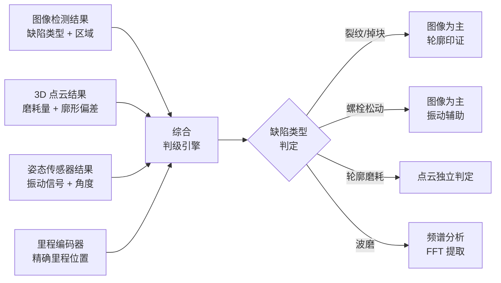

> **图 6-2：判级融合算法流程图**

| 缺陷类型 | 主要依据 | 辅助依据 | 综合判级逻辑 |
|---|---|---|---|
| 轨面裂纹 | 图像语义分割结果 | 轮廓起伏变化 | 图像为主，轮廓印证 |
| 轨面掉块 | 图像目标检测 | 轮廓深度突变 | 双维度同时超限才判定 |
| 螺栓松动 | 图像目标检测 | 姿态振动信号 | 图像为主，振动辅助 |
| 轮廓磨耗 | 3D 点云数据 | — | 点云独立判定 |

---

### 七、通信层详细说明

#### 7.1 三网物理隔离架构

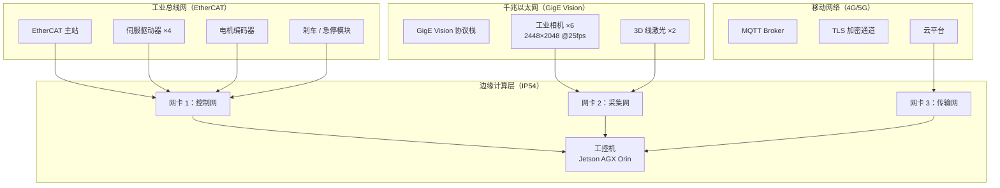

> **图 7-1：三网物理隔离架构图**
> - 三块独立网卡 + 三个独立 MAC 地址，物理层完全分离
> - 三套独立 PHY 芯片，任一网络故障不影响另外两张网

| 网络 | 物理介质 | 协议 | 带宽 | 实时性 | 用途 |
|---|---|---|---|---|---|
| **工业总线网（控制网）** | 双路 CAN FD + EtherCAT | CANopen over EtherCAT | 100 Mbps | 硬实时 ≤ 1ms | 伺服驱动、电机控制、刹车、急停 |
| **千兆以太网（采集网）** | 千兆工业以太网 | GigE Vision + TCP/IP | 1000 Mbps | 软实时 ≤ 10ms | 6路相机 + 2路激光实时采集 |
| **移动网络（传输网）** | 4G/5G 无线 | MQTT + TLS | 50~500 Mbps | 非实时秒级 | 数据上传、远程监控、模型推送 |

---

### 八、网络安全与数据安全

| 安全维度 | 措施 | 说明 |
|---|---|---|
| 传输加密 | TLS 1.3 | 移动网络传输全程加密，防止数据窃取 |
| 设备认证 | MQTT 双向认证 + Token | 云端与边缘设备 mutual authentication |
| 数据完整性 | SHA-256 校验 | 原始数据 + 判定结果均做哈希校验 |
| 边缘存储加密 | AES-256 静态加密 | SSD 数据即使被拆离也无法读取 |
| 入侵检测 | 边缘节点异常流量监控 | 实时检测并阻断异常连接请求 |
| 安全启动 | UEFI Secure Boot | 防止边缘设备刷入恶意固件 |

---

### 九、故障自愈与边缘节点异常检测

#### 9.1 健康监控指标体系

| 监控指标 | 告警阈值 | 处理动作 |
|---|---|---|
| GPU 利用率 | 持续 > 95% 超过 30s | 降频处理，减少并发推理任务 |
| 内存占用率 | > 85% | 触发 GC，清理历史缓存 |
| 磁盘剩余空间 | < 10% | 删除最旧的历史数据，保留最近 72h |
| 帧率稳定性 | 连续 10 帧丢失 | 触发传感器重置 |
| 网络延迟 | 传输延迟 > 5s | 切换本地存储，等待网络恢复 |
| GPU 温度 | > 80°C | 触发主动散热，降低推理频率 |

#### 9.2 故障自愈流程

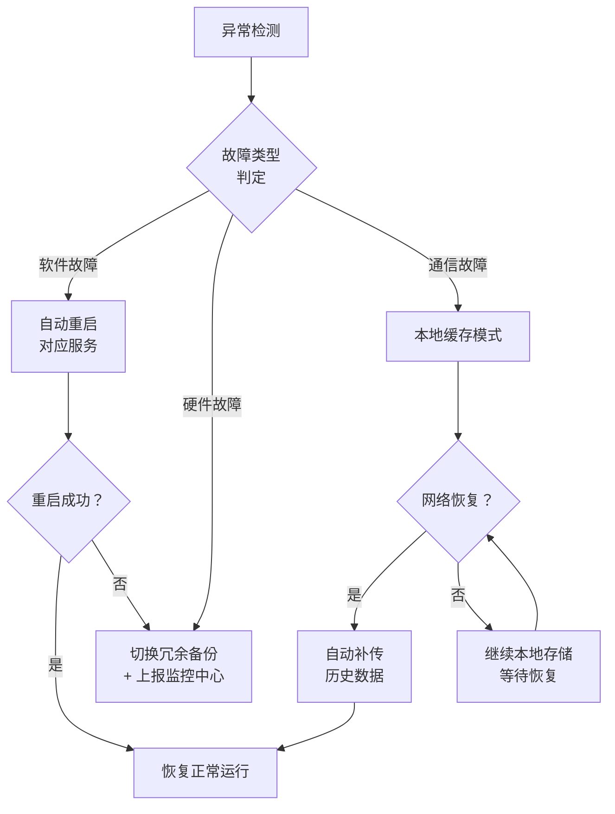

> **图 9-1：故障自愈流程图**

| 故障类型 | 检测方式 | 自愈策略 | 恢复时间 |
|---|---|---|---|
| 软件僵死 | 看门狗超时 | 自动重启服务 | < 10s |
| 相机断流 | 帧率监控 | 传感器重置 | < 30s |
| GPU 故障 | 心跳检测 | 切换 CPU 回退推理 | < 60s |
| 磁盘满 | 空间监控 | 自动删除 72h 前数据 | 即时 |
| 网络中断 | MQTT 心跳超时 | 本地缓存 + 断点续传 | 网络恢复后自动补传 |

---

### 十、边缘硬件规格

| 组件 | 型号/规格 | 说明 |
|---|---|---|
| 核心计算单元 | NVIDIA Jetson AGX Orin 64GB | 32 TOPS AI 算力，ARM Cortex-A78AE × 12 核 |
| CPU | 12 核 ARM Cortex-A78AE | 主频 2.2GHz，支持实时操作系统 |
| GPU | NVIDIA Ampere 架构 | 2048 CUDA 核 + 64 Tensor 核 |
| 内存 | 64GB LPDDR5 | 带宽 204.8 GB/s |
| 存储 | 256GB NVMe SSD（系统）+ 2TB SSD（数据） | 高速读写，支持 RAID1 数据冗余 |
| 工控机防护等级 | IP54 | 防尘 + 防溅水 |
| 工作温度 | -20°C ~ 55°C | 适应铁路现场恶劣环境 |
| 功耗 | 典型 30W，最大 60W | 支持电池供电 |

---

### 十一、核心算法数学模型汇总

> 本节汇总系统各核心检测功能涉及的数学模型，为算法实现提供明确的公式依据。

#### 11.1 里程计算模型

机器人行驶里程由光电编码器脉冲积分得到：

$$
S = \frac{\pi \cdot D}{P_{\text{res}}} \times N_{\text{pulse}}
$$

其中：

| 符号 | 含义 | 典型值 |
|---|---|---|
| $S$ | 累计行驶里程 | mm |
| $D$ | 主动轮直径 | 实测标定（mm） |
| $P_{\text{res}}$ | 编码器分辨率 | 脉冲数/圈 |
| $N_{\text{pulse}}$ | 累计脉冲计数 | 实时统计 |

里程精度：$\pm 5 \text{ mm}$（由编码器分辨率和轮径标定精度共同决定）。

#### 11.2 轨距计算模型

轨距 $G$ 由左右轨图像中钢轨内侧特征点坐标计算：

$$
G = x_{\text{left}} + x_{\text{right}} + G_{\text{nominal}}
$$

其中 $G_{\text{nominal}} = 1435 \text{ mm}$（标准轨距），$x_{\text{left}}$ 和 $x_{\text{right}}$ 分别为左右轨特征点相对各自轨道中心线的偏差（单位：mm）。

> **注**：本系统采用多传感器融合方案，结合相机视觉定位与测距传感器矩阵综合计算，测量精度 ±0.5mm。

#### 11.3 3D 轮廓磨耗量计算模型

钢轨廓形磨耗量 $W_{\text{wear}}$ 为标准廓形与实测廓形在法线方向的差值：

$$
W_{\text{wear}}(l) = \| P_{\text{std}}(l) - P_{\text{meas}}(l) \|_2 \times \cos \theta
$$

其中：

| 符号 | 含义 |
|---|---|
| $l$ | 沿钢轨延伸方向的里程坐标 |
| $P_{\text{std}}(l)$ | 标准轨廓线上里程 $l$ 处的理论三维坐标点 |
| $P_{\text{meas}}(l)$ | 实测轨廓线上里程 $l$ 处的三维坐标点（3D 线激光扫描获取） |
| $\theta$ | 实测廓点法线与标准廓点法线的夹角 |

超限判定（垂直磨耗或侧面磨耗任一项超过阈值即触发）：

$$
W_{\text{wear}}(l) > W_{\text{threshold}} \quad \text{或} \quad W_{\text{side}}(l) > W_{\text{side, threshold}}
$$

#### 11.4 波磨频谱分析模型

钢轨波磨检测采用 FFT 频谱分析：

$$
X(k) = \sum_{n=0}^{N-1} x(n) \cdot e^{-j\frac{2\pi}{N}nk}, \quad k = 0, 1, \ldots, N-1
$$

其中 $x(n)$ 为沿里程方向等间距采样的廓形高程序列，$N$ 为分析窗口内的采样点数。

主要参数提取：

| 参数 | 计算方法 | 判定阈值 |
|---|---|---|
| 波长 $\lambda$ | 频谱峰值对应频率 $f_{\text{peak}}$，$\lambda = v / f_{\text{peak}}$ | 参考《铁路线路修理规则》 |
| 波深 $A$ | 频谱峰值幅度 | $> 0.1 \text{ mm}$ 需记录 |
| 劣化指数 $D_{\text{wear}}$ | $A \times f_{\text{peak}}^2$ | 动态调整 |

#### 11.5 综合判级融合公式

多源数据综合判级采用加权证据融合模型：

$$
S_{\text{final}} = \sum_{i=1}^{n} w_i \cdot S_i \cdot C_i
$$

其中：

| 符号 | 含义 | 典型值 |
|---|---|---|
| $S_i$ | 第 $i$ 个传感器的归一化得分（0~1） | — |
| $w_i$ | 第 $i$ 个传感器的权重（$\sum w_i = 1$） | 图像 0.5 / 点云 0.3 / 姿态 0.2 |
| $C_i$ | 第 $i$ 个传感器的置信度（0~1） | 实时计算 |
| $S_{\text{final}}$ | 综合判级得分（0~1） | ≥ 0.6 触发报警 |

判级等级划分：

| 综合得分 $S_{\text{final}}$ | 损伤等级 | 处理建议 |
|---|---|---|
| $S_{\text{final}} \geq 0.85$ | **一级（严重）** | 立即停车检查 |
| $0.60 \leq S_{\text{final}} < 0.85$ | **二级（显著）** | 24h 内养护 |
| $0.30 \leq S_{\text{final}} < 0.60$ | **三级（一般）** | 纳入养护计划 |
| $S_{\text{final}} < 0.30$ | **四级（轻微）** | 持续监测 |

> **注**：所有公式中的阈值参数均可通过云平台远程调优，无需现场操作。

---
