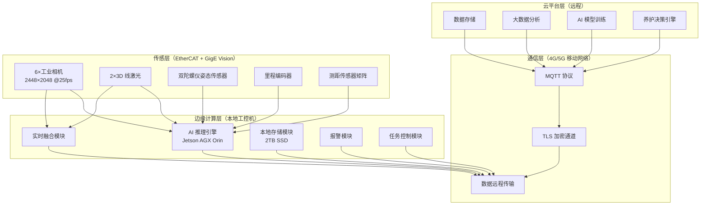
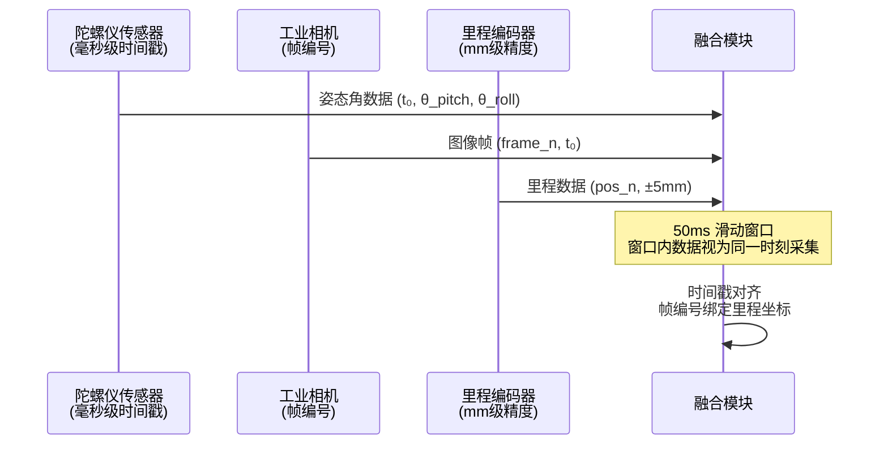
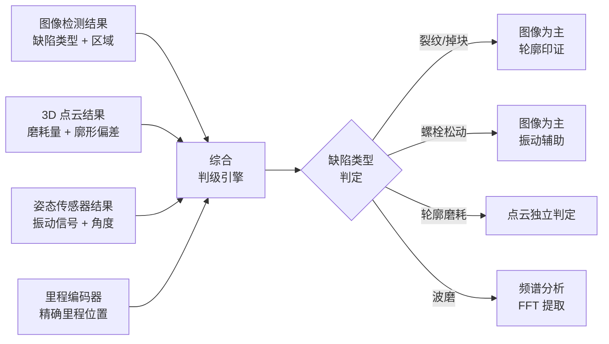
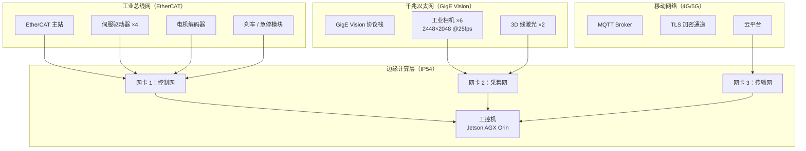
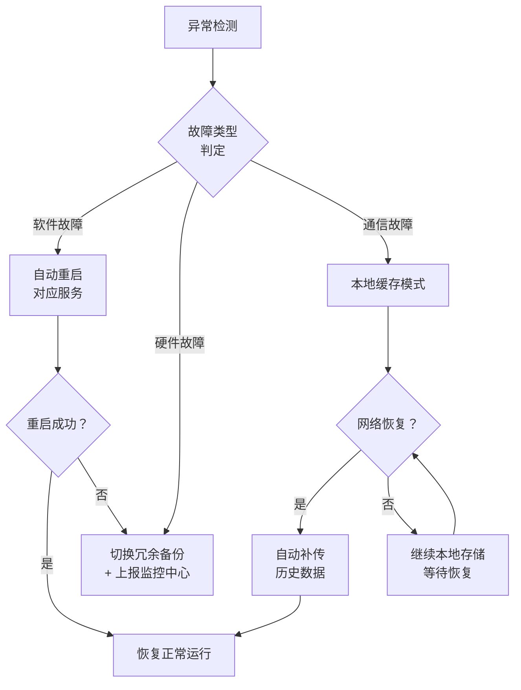

## 04 软件与 AI 算法架构

---

### 一、软件整体架构

本系统软件分为三层：边缘计算层、通信层、云平台层，三层协同实现无人干预全自动运行。

> **图 4-1：三层层级架构拓扑图**
> - 传感层通过 EtherCAT（控制，≤1ms）和 GigE Vision（采集，≤10ms）双网接入边缘计算层
> - 边缘计算层通过 4G/5G 移动网络与云平台双向通信
> - 三网物理隔离，任一网络故障不波及其他网络

---

### 二、边缘计算层

| 模块 | 功能 | 性能指标 |
|---|---|---|
| AI 推理引擎 | 边缘实时缺陷识别，秒级输出结果，无需人工看图 | 单帧 ≤ 25ms，40fps 理论峰值 |
| 实时融合模块 | 图像 + 轮廓 + 传感器三流数据融合，综合判级 | 50ms 滑动窗口内完成 |
| 本地存储模块 | 检测数据实时写入本地 SSD，断网不丢数 | RAID1 冗余，2TB 容量 |
| 报警模块 | 缺陷等级判定后立即触发本地声光报警 + 云端推送 | 报警延迟 < 100ms |
| 任务控制模块 | 启停控制 / 定速巡航 / 定点返航 / 里程到达自动返航 / 状态监控 | 响应延迟 < 50ms |

---

### 三、AI 算法模块说明

| 检测功能 | AI 算法 | 说明 |
|---|---|---|
| 轨面缺陷检测 | 图像语义分割 + 目标检测 | 像素级裂纹/掉块识别，精确定位 + 等级判定 |
| 道钉/螺栓检测 | 目标检测 + 完好状态评估 | 逐帧检测缺失/松动/歪斜，统计完好率 |
| 3D 钢轨轮廓检测 | 点云分析 + 廓形比对 | 磨耗量计算，横移量测量，超限判定 |
| 钢轨波磨检测 | 频谱分析 + 廓变提取 | 波长/波深分析，分布里程标记 |
| 钢轨焊缝检测 | 图像分类 + 缺陷分割 | 焊缝缺陷类型识别，等级判定 |
| 轨距检测 | 传感器融合 + 数值计算 | 多源数据融合，轨距值计算 |
| 水平/高低检测 | 陀螺仪数据积分 + 阈值判定 | 姿态角计算，超限标记 |

> **AI 决策可解释**：每项缺陷输出结果时，同步附带判定依据（图像区域 / 廓形偏差值 / 姿态角），用户可知晓 AI "为什么这么说"。

#### 3.1 轨面缺陷检测算法（图像语义分割 + 目标检测）

本系统对轨面伤损的检测采用两阶段算法：**第一阶段**使用语义分割模型（U-Net / DeepLabV3+）逐像素分类，输出像素级缺陷掩膜；**第二阶段**使用目标检测模型（YOLOv8）对掩膜区域进行缺陷边界框回归与类型分类。两阶段结果融合后输出带置信度的缺陷判定结果。

**第一阶段：像素级语义分割**

输入图像 $I(x,y)$ 经编码器-解码器网络后，输出每个像素的类别概率向量：

$$\hat{\mathbf{p}}(x,y) = \text{Softmax}\left( f_{\text{dec}}\left( f_{\text{enc}}\left( I(x,y) \right) \right) \right)$$

其中 $f_{\text{enc}}$ 为编码器（含 ResNet50 主干网络），$f_{\text{dec}}$ 为解码器（含 ASPP 多尺度融合模块），输出通道数等于缺陷类别数（含"正常"类）。

像素 $(x,y)$ 的最终类别判定：

$$c^{*}(x,y) = \arg\max_{c \in \{0,1,\ldots,N\}} \hat{p}_c(x,y)$$

其中 $c=0$ 为正常轨面，$c=1,\ldots,N$ 为各类伤损（裂纹、掉块、凹陷等）。

**第二阶段：缺陷目标检测（NMS 去重）**

目标检测网络对语义分割输出的伤损连通区域提取候选框 $\mathbf{b}_i = (x_i, y_i, w_i, h_i, \hat{c}_i, \hat{s}_i)$，其中 $(x_i,y_i)$ 为边界框中心，$w_i,h_i$ 为宽高，$\hat{c}_i$ 为预测类别，$\hat{s}_i$ 为置信度得分。

多目标去重采用 NMS（非极大值抑制）：

$$\mathbf{b}_{\text{keep}} = \text{NMS}\left( \{\mathbf{b}_i\} \right)$$

具体流程：
1. 按置信度 $\hat{s}_i$ 从高到低排序所有候选框
2. 选取当前最高置信度框 $\mathbf{b}_{\text{max}}$ 加入保留列表
3. 删除所有与 $\mathbf{b}_{\text{max}}$ IoU（交并比）超过阈值（默认 0.5）的候选框
4. 重复 1~3，直至所有框处理完毕

IoU 计算：

$$\text{IoU}(\mathbf{b}_a, \mathbf{b}_b) = \frac{\text{Area}(\mathbf{b}_a \cap \mathbf{b}_b)}{\text{Area}(\mathbf{b}_a \cup \mathbf{b}_b)}$$

**伤损等级判定（面积阈值法）**

伤损严重程度按像素面积 $A_{\text{defect}}$ 划分：

| 伤损面积 $A_{\text{defect}}$（像素） | 伤损等级 | 建议处理等级 |
|---|---|---|
| $A < A_1$（$A_1 = 400$ px） | 轻微 | 四级：持续监测 |
| $A_1 \leq A < A_2$（$A_2 = 1600$ px） | 一般 | 三级：纳入养护计划 |
| $A_2 \leq A < A_3$（$A_3 = 3600$ px） | 显著 | 二级：24h 内养护 |
| $A \geq A_3$ | 严重 | 一级：立即停车检查 |

> 注：像素面积与实际物理尺寸的换算关系为 $1\text{ px} \approx 0.18\text{ mm}$（2448×2048 分辨率下，轨面宽度覆盖 440mm）。

**综合伤损得分**

两阶段融合后的综合伤损得分：

$$D_{\text{rail}} = \lambda_{\text{seg}} \cdot \frac{A_{\text{defect}}}{A_{\text{roi}}} + \lambda_{\text{det}} \cdot \hat{s}_{\text{max}}$$

其中：$A_{\text{roi}}$ 为轨面感兴趣区域总面积，$\hat{s}_{\text{max}}$ 为目标检测阶段最高置信度，$\lambda_{\text{seg}}+\lambda_{\text{det}}=1$（默认各 0.5）。

---

#### 3.2 道钉/螺栓完好状态评估算法

道钉/螺栓的完好状态通过**目标检测 + 时序比对**两维度综合判定：

**维度一：目标检测（有无判定）**

YOLOv8 模型对每帧图像输出道钉/螺栓候选框 $\mathbf{b}_j$，包含类别 $\hat{c}_j \in \{\text{缺失}, \text{松动}, \text{歪斜}, \text{正常}\}$ 和置信度 $\hat{s}_j$。

当前帧完好率：

$$\eta_{\text{current}} = \frac{N_{\text{正常}}}{N_{\text{总检测数}}} \times 100\%$$

其中 $N_{\text{总检测数}}$ 由里程编码器辅助统计：每 $700\text{ mm}$（道钉/螺栓标准节距）应检测到一个道钉/螺栓目标。

**维度二：松动/歪斜时序比对（振动信号辅助）**

当目标检测输出"松动"或"歪斜"时，融合双陀螺仪的姿态振动信号进行二次确认。振动信号幅值 $a_{\text{vib}}$ 与正常基准值 $a_{\text{base}}$ 的比值作为辅助判据：

$$R_{\text{vib}} = \frac{a_{\text{vib}}}{a_{\text{base}}}$$

- 若 $R_{\text{vib}} > \tau_{\text{vib}}$（$\tau_{\text{vib}} = 1.5$，表示振动幅值超出正常基准 50%），则判定为"松动"，综合得分：

$$S_{\text{fastener}} = w_{\text{det}} \cdot \hat{s}_j + w_{\text{vib}} \cdot \min\left( \frac{R_{\text{vib}}}{\tau_{\text{vib}}}, 1.0 \right)$$

其中 $w_{\text{det}} + w_{\text{vib}} = 1$（默认 $w_{\text{det}}=0.7, w_{\text{vib}}=0.3$）。

**完好率统计与里程绑定**

沿里程方向对道钉/螺栓完好状态做滑动统计，窗口长度 $L_{\text{window}} = 100\text{ m}$：

$$\eta_{\text{section}} = \frac{1}{L_{\text{window}}} \int_{l}^{l+L_{\text{window}}} \eta_{\text{current}}(l') \, dl'$$

| 区段完好率 $\eta_{\text{section}}$ | 状态评级 | 处理建议 |
|---|---|---|
| $\eta \geq 98\%$ | A（优良） | 持续监测 |
| $95\% \leq \eta < 98\%$ | B（合格） | 列入次月养护 |
| $90\% \leq \eta < 95\%$ | C（预警） | 列入本周养护 |
| $\eta < 90\%$ | D（告警） | 立即安排养护 |

> **注**：道钉/螺栓节距 $700\text{ mm}$，若连续 3 个以上未检测到目标，触发"疑似缺失"告警，并标注里程位置，人工复核确认。

---

### 四、远程升级与模型迭代

| 功能 | 说明 |
|---|---|
| 模型远程推送 | AI 检测模型可通过移动网络远程推送更新，持续提升精度 |
| 数据回传训练 | 检测数据匿名化后回传云端，用于模型迭代训练 |
| 远程参数调优 | 可远程调整检测阈值、报警策略，无需到场 |

---

### 五、AI 推理引擎详细架构

本系统边缘推理采用 CPU + GPU 异构架构，兼顾实时性与低功耗：

| 层级 | 组件 | 说明 |
|---|---|---|
| 输入预处理层 | 图像归一化 + 点云滤波 | 2448×2048 原始图像预处理为模型输入格式 |
| AI 推理层 | NVIDIA Jetson AGX Orin（嵌入式 GPU） | 32 TOPS AI 算力，支持 INT8/FP16 并行推理 |
| 推理框架 | TensorRT 加速 | 模型推理延迟 < 20ms/帧 |
| 后处理层 | NMS + 阈值过滤 | 多目标去重、缺陷分级判定 |
| 输出层 | JSON 结构化结果 | 缺陷类型 + 里程坐标 + 损伤等级 + 置信度 |

#### 5.1 推理流水线时序模型

```mermaid
gantt
    title 推理流水线时序（单帧处理 ≤ 25ms）
    dateFormat X
    axisFormat %sms

    section 预处理
    图像采集 & 归一化     :done, 0, 2ms
    点云滤波 & 配准        :done, 0, 2ms

    section GPU推理
    模型推理（TensorRT）  :active, 2, 17ms

    section 后处理
    NMS 去重              :done, 17, 19ms
    阈值过滤 & 判级       :done, 19, 20ms

    section 融合判定
    三流融合 & 综合判级    :done, 20, 25ms

    section 输出
    JSON 封装 & 存储      :done, 25, 25ms
```

> **图 4-2：单帧推理流水线时序图**
> - 总延迟：≤ 25ms（含安全冗余）
> - 理论最大处理帧率：40 fps（1000ms / 25ms）
> - 实际工作帧率：25 fps（含 5ms 安全余量）

#### 5.2 推理吞吐量数学模型

单帧处理延迟 $T_{\text{frame}}$ 由各环节延迟叠加构成：

$$
T_{\text{frame}} = T_{\text{pre}} + T_{\text{GPU}} + T_{\text{post}} + T_{\text{fusion}} + T_{\text{margin}}
$$

其中：

| 符号 | 含义 | 典型值 |
|---|---|---|
| $T_{\text{pre}}$ | 预处理延迟（图像归一化 + 点云滤波） | 2 ms |
| $T_{\text{GPU}}$ | TensorRT GPU 推理延迟 | 15 ms |
| $T_{\text{post}}$ | 后处理延迟（NMS + 阈值过滤） | 3 ms |
| $T_{\text{fusion}}$ | 三流融合判定延迟 | 5 ms |
| $T_{\text{margin}}$ | 安全余量 | 0~5 ms |

代入典型值：

$$
T_{\text{frame}} = 2 + 15 + 3 + 5 + 0 = 25 \text{ ms}
$$

理论最大帧率：

$$
f_{\text{max}} = \frac{1}{T_{\text{frame}}} = \frac{1}{25 \times 10^{-3}} = 40 \text{ fps}
$$

实际推荐帧率（含 5ms 余量）：

$$
f_{\text{actual}} = \frac{1}{30 \times 10^{-3}} \approx 33 \text{ fps} \quad \Rightarrow \text{取} 25 \text{ fps}
$$

---

### 六、实时融合算法细节

三流数据融合采用"时间窗口对齐 + 空间位置关联 + 判级融合"三级结构：

#### 6.1 第一级：时间窗口对齐

> **图 4-3：时间窗口对齐时序图**
> - 陀螺仪数据：毫秒级时间戳，与相机帧编号精确对应
> - 里程编码器：每帧图像绑定当前里程坐标，精度 ±5mm
> - 融合窗口：50ms 滑动窗口，窗口内数据视为同一时刻采集

#### 6.2 第二级：空间位置关联

- 左右轨独立建模，左右钢轨数据独立融合判定
- 缺陷位置 = 里程坐标 + 轨距偏移（左右轨定位）
- 姿态角绑定：缺陷位置同步记录当前机器人俯仰角/侧倾角

#### 6.3 第三级：判级融合输出

> **图 4-4：判级融合算法流程图**

| 缺陷类型 | 主要依据 | 辅助依据 | 综合判级逻辑 |
|---|---|---|---|
| 轨面裂纹 | 图像语义分割结果 | 轮廓起伏变化 | 图像为主，轮廓印证 |
| 轨面掉块 | 图像目标检测 | 轮廓深度突变 | 双维度同时超限才判定 |
| 螺栓松动 | 图像目标检测 | 姿态振动信号 | 图像为主，振动辅助 |
| 轮廓磨耗 | 3D 点云数据 | — | 点云独立判定 |

---

### 七、通信层详细说明

#### 7.1 三网物理隔离架构

> **图 4-5：三网物理隔离架构图**
> - 三块独立网卡 + 三个独立 MAC 地址，物理层完全分离
> - 三套独立 PHY 芯片，任一网络故障不影响另外两张网

| 网络 | 物理介质 | 协议 | 带宽 | 实时性 | 用途 |
|---|---|---|---|---|---|
| **工业总线网（控制网）** | 双路 CAN FD + EtherCAT | CANopen over EtherCAT | 100 Mbps | 硬实时 ≤ 1ms | 伺服驱动、电机控制、刹车、急停 |
| **千兆以太网（采集网）** | 千兆工业以太网 | GigE Vision + TCP/IP | 1000 Mbps | 软实时 ≤ 10ms | 6路相机 + 2路激光实时采集 |
| **移动网络（传输网）** | 4G/5G 无线 | MQTT + TLS | 50~500 Mbps | 非实时秒级 | 数据上传、远程监控、模型推送 |

---

### 八、网络安全与数据安全

| 安全维度 | 措施 | 说明 |
|---|---|---|
| 传输加密 | TLS 1.3 | 移动网络传输全程加密，防止数据窃取 |
| 设备认证 | MQTT 双向认证 + Token | 云端与边缘设备 mutual authentication |
| 数据完整性 | SHA-256 校验 | 原始数据 + 判定结果均做哈希校验 |
| 边缘存储加密 | AES-256 静态加密 | SSD 数据即使被拆离也无法读取 |
| 入侵检测 | 边缘节点异常流量监控 | 实时检测并阻断异常连接请求 |
| 安全启动 | UEFI Secure Boot | 防止边缘设备刷入恶意固件 |

---

### 九、故障自愈与边缘节点异常检测

#### 9.1 健康监控指标体系

| 监控指标 | 告警阈值 | 处理动作 |
|---|---|---|
| GPU 利用率 | 持续 > 95% 超过 30s | 降频处理，减少并发推理任务 |
| 内存占用率 | > 85% | 触发 GC，清理历史缓存 |
| 磁盘剩余空间 | < 10% | 删除最旧的历史数据，保留最近 72h |
| 帧率稳定性 | 连续 10 帧丢失 | 触发传感器重置 |
| 网络延迟 | 传输延迟 > 5s | 切换本地存储，等待网络恢复 |
| GPU 温度 | > 80°C | 触发主动散热，降低推理频率 |

#### 9.2 故障自愈流程

> **图 4-6：故障自愈流程图**

| 故障类型 | 检测方式 | 自愈策略 | 恢复时间 |
|---|---|---|---|
| 软件僵死 | 看门狗超时 | 自动重启服务 | < 10s |
| 相机断流 | 帧率监控 | 传感器重置 | < 30s |
| GPU 故障 | 心跳检测 | 切换 CPU 回退推理 | < 60s |
| 磁盘满 | 空间监控 | 自动删除 72h 前数据 | 即时 |
| 网络中断 | MQTT 心跳超时 | 本地缓存 + 断点续传 | 网络恢复后自动补传 |

---

### 十、边缘硬件规格

| 组件 | 型号/规格 | 说明 |
|---|---|---|
| 核心计算单元 | NVIDIA Jetson AGX Orin 64GB | 32 TOPS AI 算力，ARM Cortex-A78AE × 12 核 |
| CPU | 12 核 ARM Cortex-A78AE | 主频 2.2GHz，支持实时操作系统 |
| GPU | NVIDIA Ampere 架构 | 2048 CUDA 核 + 64 Tensor 核 |
| 内存 | 64GB LPDDR5 | 带宽 204.8 GB/s |
| 存储 | 256GB NVMe SSD（系统）+ 2TB SSD（数据） | 高速读写，支持 RAID1 数据冗余 |
| 工控机防护等级 | IP54 | 防尘 + 防溅水 |
| 工作温度 | -20°C ~ 55°C | 适应铁路现场恶劣环境 |
| 功耗 | 典型 30W，最大 60W | 支持电池供电 |

---

### 十一、核心算法数学模型汇总

> 本节汇总系统各核心检测功能涉及的数学模型，为算法实现提供明确的公式依据。

#### 11.1 里程计算模型

机器人行驶里程由光电编码器脉冲积分得到：

$$
S = \frac{\pi \cdot D}{P_{\text{res}}} \times N_{\text{pulse}}
$$

其中：

| 符号 | 含义 | 典型值 |
|---|---|---|
| $S$ | 累计行驶里程 | mm |
| $D$ | 主动轮直径 | 实测标定（mm） |
| $P_{\text{res}}$ | 编码器分辨率 | 脉冲数/圈 |
| $N_{\text{pulse}}$ | 累计脉冲计数 | 实时统计 |

里程精度：$\pm 5 \text{ mm}$（由编码器分辨率和轮径标定精度共同决定）。

#### 11.2 轨距计算模型

轨距 $G$ 由左右轨图像中钢轨内侧特征点坐标计算：

$$
G = x_{\text{left}} + x_{\text{right}} + G_{\text{nominal, offset}}
$$

其中 $G_{\text{nominal}} = 1435 \text{ mm}$（标准轨距），$x_{\text{left}}$ 和 $x_{\text{right}}$ 分别为左右轨特征点相对各自轨道中心线的偏差（单位：mm）。

> **注**：本系统采用多传感器融合方案，结合相机视觉定位与测距传感器矩阵综合计算，测量精度 ±0.5mm。

#### 11.3 3D 轮廓磨耗量计算模型

钢轨廓形磨耗量 $W_{\text{wear}}$ 为标准廓形与实测廓形在法线方向的差值：

$$
W_{\text{wear}}(l) = \| P_{\text{std}}(l) - P_{\text{meas}}(l) \|_2 \times \cos \theta
$$

其中：

| 符号 | 含义 |
|---|---|
| $l$ | 沿钢轨延伸方向的里程坐标 |
| $P_{\text{std}}(l)$ | 标准轨廓线上里程 $l$ 处的理论三维坐标点 |
| $P_{\text{meas}}(l)$ | 实测轨廓线上里程 $l$ 处的三维坐标点（3D 线激光扫描获取） |
| $\theta$ | 实测廓点法线与标准廓点法线的夹角 |

超限判定（垂直磨耗或侧面磨耗任一项超过阈值即触发）：

$$
W_{\text{wear}}(l) > W_{\text{threshold}} \quad \text{或} \quad W_{\text{side}}(l) > W_{\text{side, threshold}}
$$

#### 11.4 波磨频谱分析模型

钢轨波磨检测采用 FFT 频谱分析：

$$
X(k) = \sum_{n=0}^{N-1} x(n) \cdot e^{-j\frac{2\pi}{N}nk}, \quad k = 0, 1, \ldots, N-1
$$

其中 $x(n)$ 为沿里程方向等间距采样的廓形高程序列，$N$ 为分析窗口内的采样点数。

主要参数提取：

| 参数 | 计算方法 | 判定阈值 |
|---|---|---|
| 波长 $\lambda$ | 频谱峰值对应频率 $f_{\text{peak}}$，$\lambda = v / f_{\text{peak}}$ | 参考《铁路线路修理规则》 |
| 波深 $A$ | 频谱峰值幅度 | $> 0.1 \text{ mm}$ 需记录 |
| 劣化指数 $D_{\text{wear}}$ | $A \times f_{\text{peak}}^2$ | 动态调整 |

#### 11.5 综合判级融合公式

多源数据综合判级采用加权证据融合模型：

$$
S_{\text{final}} = \sum_{i=1}^{n} w_i \cdot S_i \cdot C_i
$$

其中：

| 符号 | 含义 | 典型值 |
|---|---|---|
| $S_i$ | 第 $i$ 个传感器的归一化得分（0~1） | — |
| $w_i$ | 第 $i$ 个传感器的权重（$\sum w_i = 1$） | 图像 0.5 / 点云 0.3 / 姿态 0.2 |
| $C_i$ | 第 $i$ 个传感器的置信度（0~1） | 实时计算 |
| $S_{\text{final}}$ | 综合判级得分（0~1） | ≥ 0.6 触发报警 |

判级等级划分：

| 综合得分 $S_{\text{final}}$ | 损伤等级 | 处理建议 |
|---|---|---|
| $S_{\text{final}} \geq 0.85$ | **一级（严重）** | 立即停车检查 |
| $0.60 \leq S_{\text{final}} < 0.85$ | **二级（显著）** | 24h 内养护 |
| $0.30 \leq S_{\text{final}} < 0.60$ | **三级（一般）** | 纳入养护计划 |
| $S_{\text{final}} < 0.30$ | **四级（轻微）** | 持续监测 |

> **注**：所有公式中的阈值参数均可通过云平台远程调优，无需现场操作。

---

